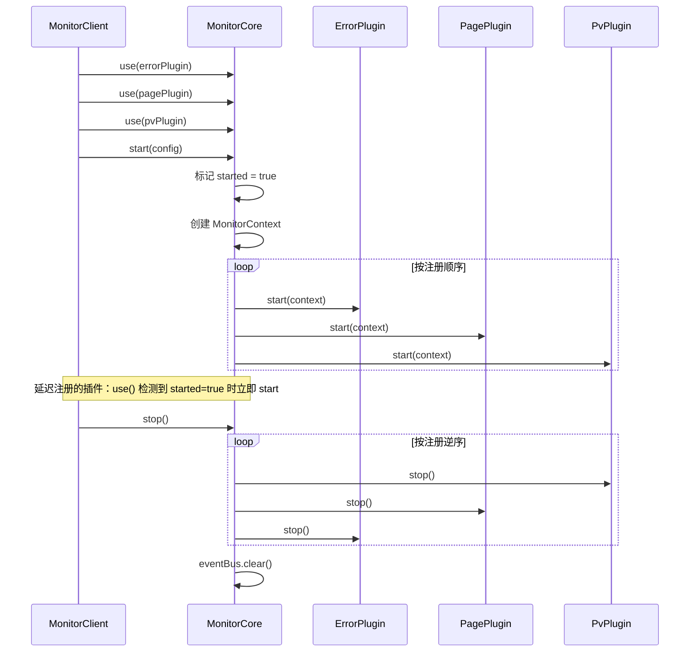
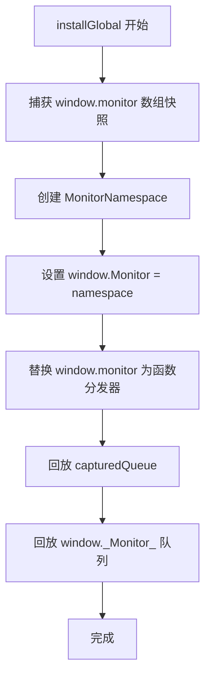
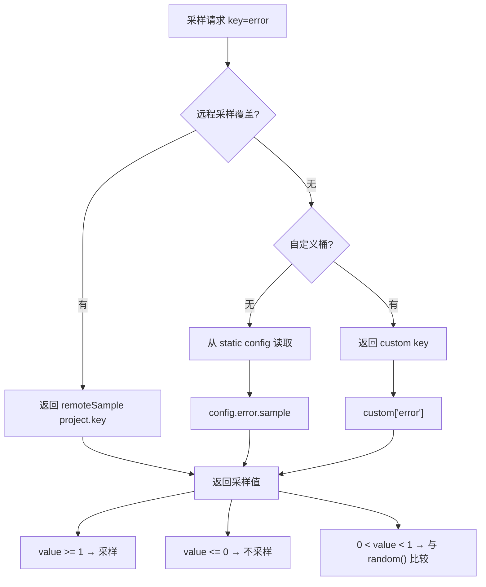
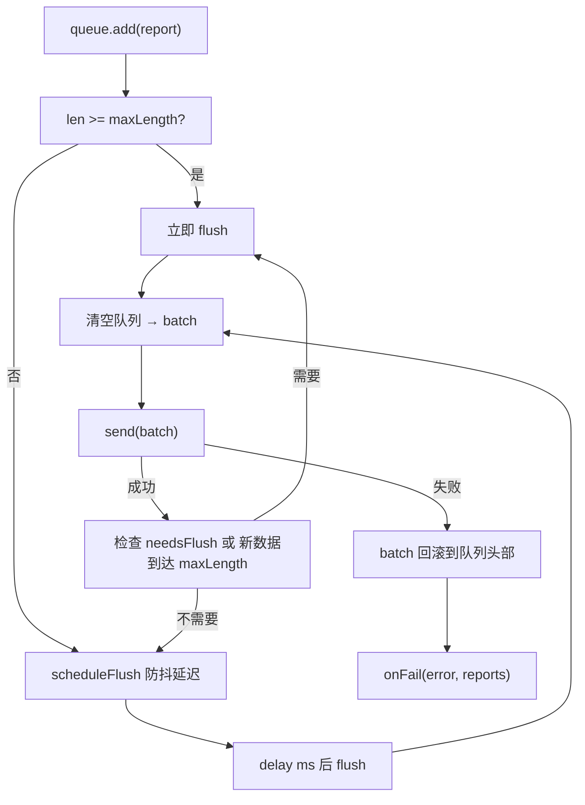

# Monitor SDK 架构难点与关键点梳理

> 本文档梳理 monitor 前端监控 SDK 的架构设计、核心技术难点及关键实现细节。

---

## 一、项目概览

Monitor 是一个**前端监控 SDK**，基于 TypeScript + PNPM + Vite 构建的 Monorepo 工作区。核心目标是在浏览器和容器（WebView）环境中采集页面性能、错误、资源、API、PV、自定义指标等数据，并通过多种传输通道上报到服务端。

### 子项目结构

```
monitor/
├── packages/
│   ├── config/          # 默认配置、端点常量、配置合并
│   ├── protocol/        # 各通道数据模型与编码（含自研 Protobuf）
│   ├── transport/       # 传输层（XHR/Beacon/Bridge + 队列/缓存）
│   ├── core/            # 核心运行时（插件生命周期、事件总线、配置管理）
│   ├── sdk/             # 聚合入口（Monitor/MonitorClient + 全局安装）
│   ├── plugin-error/    # JS 错误捕获与上报
│   ├── plugin-pv/       # 页面浏览上报 + SPA 路由监听
│   ├── plugin-metric/   # 自定义指标采集
│   ├── plugin-resource/ # 资源/Ajax/Fetch 监控
│   ├── plugin-page/     # Navigation Timing + 首屏（FST）检测
│   ├── plugin-perf-fsp/# 秒开（首屏填充率）
│   ├── plugin-perf-ird/ # 交互响应延迟
│   ├── plugin-perf-shr/ # 滚动帧率与掉帧
│   └── plugin-perf-cache/# 性能数据离线缓存
├── apps/
│   ├── mock-server/     # 本地上报接收服务（Node.js）
│   └── playground/      # 浏览器验证应用（15 种触发动作）
├── scripts/
│   └── check-size.mjs   # 文件/函数行数约束检查
└── docs/
    └── verification.md  # 手工验证记录
```

---

## 二、架构设计关键点

### 2.1 插件化生命周期

整个 SDK 基于**插件生命周期**模式构建。核心类是 `MonitorCore`，负责：

```
注册 (use) → 启动 (start) → 运行 → 停止 (stop)
```



**关键设计决策：**

| 决策               | 说明                                                                 |
| ------------------ | -------------------------------------------------------------------- |
| FIFO 启动          | `start()` 按注册顺序逐一调用插件，保证依赖靠前的插件先初始化         |
| LIFO 停止          | `stop()` 按逆序调用，后注册的先清理，避免依赖断裂                    |
| 延迟注册           | `start()` 之后再调 `use()` 的插件，立即执行 `start(context)`         |
| 幂等 start         | 重复调用 `start()` 被忽略，防止重复初始化                            |
| 部分公开 `onReady` | 错误、PV、Metric 等插件通过 `onReady` 回调暴露内部 Manager 给 SDK 层 |

### 2.2 MonitorContext 依赖注入

每个插件通过 `MonitorContext` 获得四个核心能力，不直接依赖全局变量：

```typescript
interface MonitorContext {
  cfgManager: CfgManager; // 配置管理 + 采样判断
  eventBus: EventBus; // 事件总线（松耦合跨插件通信）
  transport: Transport; // 传输通道（XHR/Beacon/Bridge）
  logger: Logger; // 开发模式日志
}
```

**设计优势：**

- 所有外部依赖可注入（XHR 构造函数、localStorage、navigator、fetch、history 等），便于单元测试
- 无全局单例污染——通过 `Monitor.create(config)` 可创建完全独立的客户端实例

### 2.3 全局安装与队列回放

SDK 加载可能晚于页面脚本。通过**双队列机制**解决：

```
页面 HTML:
  <script>
    window.monitor = window.monitor || [];
    window.monitor.push(["start", { project: "app" }]);  // 先排队
  </script>
  <script src="monitor-sdk.js"></script>                  // SDK 后加载
```

SDK 加载后执行流程：



**两种队列项格式：**

- 元组：`["start", config]` → `monitor.start(config)`
- 函数：`function(m) { m.debug(); }` → 以 namespace 为参数调用

### 2.4 蜘蛛/爬虫过滤

`MonitorClient.start()` 的第一步就是检测 User-Agent 是否为爬虫：

```
已知爬虫列表: baiduspider | googlebot | bingbot | 360spider | sogou |
             yisouspider | bytespider | petalbot | slurp | yandexbot |
             duckduckbot | facebot | twitterbot | ahrefsbot
```

如果是爬虫，**整个 SDK 不启动任何插件**，零开销。

---

## 三、数据协议层 — 核心难点

### 3.1 多通道多编码策略

不同上报通道使用**完全不同的编码格式**，全部手写实现（无第三方依赖）：

| 通道                   | 请求方式 | Content-Type                        | 编码策略                     |
| ---------------------- | -------- | ----------------------------------- | ---------------------------- |
| PV                     | GET      | —                                   | URL Query 参数               |
| 错误 (logts)           | POST     | `application/x-www-form-urlencoded` | `c=encodeURIComponent(JSON)` |
| 资源文本 (dev)         | POST     | `application/json`                  | JSON                         |
| 资源 Protobuf (prod)   | POST     | `application/octet-stream`          | **自研 Protobuf 编码器**     |
| 页面速度               | GET      | —                                   | 管道分隔的 27 点数组         |
| 自定义指标             | POST     | `application/json`                  | JSON                         |
| 性能指标 (FSP/IRD/SHR) | POST     | `application/json`                  | JSON PerfLogPayload          |

### 3.2 自研 Protobuf 编码器（无第三方依赖）

**这是整个项目中技术难度最高的模块之一。**

在 `packages/protocol/src/resource.ts` 中实现了一个最小化的 Protobuf Writer：

```typescript
class ProtobufWriter {
  uint32(value: number)   // Varint 编码（7-bit 分组 + MSB 延续位）
  string(value: string)   // Varint 长度前缀 + UTF-8 字节
  fork() / ldelim(sub)   // 嵌套消息（length-delimited）
  finish()                // 拼接所有 chunk → Uint8Array
}
```

**资源批次顶层结构（protobuf）：**

| Field                      | Tag 值 | Wire Type  |
| -------------------------- | ------ | ---------- |
| infos (repeated BatchInfo) | 1      | 2 (ldelim) |
| region                     | 2      | 2          |
| operator                   | 3      | 2          |
| network                    | 4      | 2          |
| container                  | 5      | 2          |
| os                         | 6      | 2          |
| connectType                | 7      | 2          |
| unionId                    | 8      | 2          |

**BatchInfo 内部 17 个字段**，Tag 号从 10 到 138（非连续）。

**难点：**

- 需要理解 Protobuf wire format（Varint 编码、field number << 3 | wire_type 的 tag 计算）
- 必须与后端 Protobuf schema 精确匹配，不能使用标准 protobuf 库
- 生产环境发送 Protobuf；失败时自动降级到 JSON

### 3.3 页面速度 27 点编码

`encodePageSpeed` 将 Navigation Timing API 的 20 个原始时间点 + 7 个派生指标编码为管道分隔字符串：

```
"0|5|3|10|15|...|25|50|80|..."
```

- 索引 0：占位（始终为 0）
- 索引 1-19：W3C Navigation Timing 原始偏移量
- 索引 20-22：DNS / TCP / Download 派生时间
- 索引 23-26：First Paint / FCP / FST / FCP（首屏级）

**难点：**

- 派生指标（dns/tcp/download）优先使用预计算值，未提供时从原始时间点**实时计算**
- Paint/FST/FCP 指标**仅当实际采集到时**才写入对应索引位置
- `normalize()` 将非法值（负数、Infinity、NaN）钳制为 0

---

## 四、采样系统 — 三层架构



### 采样键重映射

远程下发的采样键名与 SDK 内部键名不同，通过 `remoteSamplingKeyMap` 映射：

| 远程键      | SDK 内部键 |
| ----------- | ---------- |
| performance | page       |
| request     | api        |
| log         | error      |
| resource    | resource   |

未知键进入 `custom` 桶，按自定义键直接匹配。

### API 采样读/写不一致（已知注意事项）

`getSampleValue("api")` 从 `config.resource.sampleApi ?? 1` 读取，但 `applySampling` 写入时写入 `config.api.sample`。这意味着如果仅通过 `applySampling` 设置 API 采样，实际读取可能取不到该值——需要同时关注 `config.resource.sampleApi` 和 `config.api.sample` 两个字段。

---

## 五、传输层 — 关键设计

### 5.1 三通道传输

| 通道   | 场景          | 返回值                    | 特点                                        |
| ------ | ------------- | ------------------------- | ------------------------------------------- |
| XHR    | 常规上报      | `{ ok, status, body }`    | 有状态码、支持超时、可获取响应              |
| Beacon | 页面卸载      | `{ ok: true, status: 0 }` | Fire-and-forget、浏览器保证发送、无法读状态 |
| Bridge | 容器 JSBridge | `{ ok: true, status: 0 }` | 通过原生 Bridge 通信                        |

### 5.2 ReportQueue 批量与重试

`ReportQueue<T>` 是通用批处理引擎：



**关键保护机制：**

- **重入保护**：如果 `flush()` 正在执行中，并发调用设置 `needsFlush` 标志，当前 flush 完成后立即再次 flush
- **失败回滚**：发送失败时将整个 batch 回滚到队列**头部**（`unshift`），保持原始顺序
- **最小延迟**：`delay` 强制执行下限（默认 1000ms），防止过于激进的发送

### 5.3 容器桥接缓存与重试

`createContainerBridgeReporter` 处理容器 JSBridge 不可用的场景：

1. 如果桥接方法存在 → 发送当前事件，同时**先 flush 缓存**
2. 如果桥接方法不存在 → 事件写入 localStorage 缓存
3. 方法回退链：`preferredMethod` → `fallbackMethods[0]` → `fallbackMethods[1]` → ...
4. 缓存上限 `cacheMaxLength`（默认 50），超出时丢弃最旧记录

### 5.4 页面卸载时的 Beacon 降级

错误插件在页面卸载时（`pagehide` / `beforeunload`）：

- 合并当前队列 + 在途请求中的错误
- 优先使用 `sendBeacon`（保证在页面关闭前发送）
- 如果 Beacon 不可用，降级写入 localStorage

---

## 六、插件难点详解

### 6.1 错误插件 — 多重去重与速率限制

**双重去重机制：**

| 机制     | 方法            | 作用                                                            |
| -------- | --------------- | --------------------------------------------------------------- |
| 内容去重 | `isExist()`     | 对比错误队列中的完整 content/rowNum/colNum，完全相同则丢弃      |
| 键去重   | `isDuplicate()` | 在可配置时间窗口内，相同 `content + rowNum + colNum` 只保留一条 |

**速率限制算法：**

- 跟踪错误间隔的**中位数**和一个动态阈值
- 在 `checkRateLimit` 中，**先计算 `timeSinceStart`，再重置**
- 单个插件异常不影响后续监听器（EventBus emit 的 catch 块为空）

**错误捕获多订阅模式：**

```
window.onerror ────────────────────┬─→ ErrorManager (SDK)
                                   │
unhandledrejection ────────────────┤
                                   │
console.error ─────────────────────┘
```

使用 `WeakMap` 存储每个 `window` 对象的共享捕获状态，多个订阅者可以共享同一个 `window` 钩子。

**在途请求保护：**

- `sendErrors` 期间用 `cacheSending` Map 跟踪进行中的请求
- 页面卸载时同时合并当前队列和 `cacheSending` 中的错误，防止丢失

**远程采样响应：**

- 错误上报成功后，从响应体中解析 `sampling` 字段
- 调用 `cfgManager.applyRemoteSampling()` 动态更新采样率

### 6.2 资源插件 — 构造函数替换与双采样

**XHR 拦截采用构造函数替换（非原型修补）：**

```typescript
const OriginalXHR = window.XMLHttpRequest;
window.XMLHttpRequest = PatchedXHR; // 整个构造函数替换
```

这比原型修补更彻底，但风险也更大——与页面上其他修改 `XMLHttpRequest` 的库可能冲突。

**Fetch 拦截非侵入式：**

- 替换 `window.fetch`
- 拦截后**重新抛出**错误，保证标准错误处理仍然触发
- `clone()` 响应体进行业务码解析，不消耗原始响应

**双采样入口：**

- `pushCall()` — 资源性能数据，使用 `sample` 采样率
- `pushApi()` — XHR/Fetch 数据，使用 `sampleApi` 采样率
- 两者独立控制，满足不同上报量的需求

**图片监控：**

- `PerformanceObserver` 监听资源条目，过滤 `img` 类型
- 体积超出阈值（`fileSize * 1000` 字节）→ `IMAGE_SIZE_EXCEED`
- 加载耗时超出 `maxDuration` → `IMAGE_DURATION_EXCEED`
- 触发后路由到 `ErrorManager.reportSystemWarn()`

### 6.3 秒开（FSP）— 视口填充率检测

**核心算法：`FspViewportDetector`**

将视口划分为 **3 列 × 6 行 = 18 个格子**：

```
┌───┬───┬───┬───┬───┬───┐
│   │   │   │   │   │   │  ← 上 1/3
├───┼───┼───┼───┼───┼───┤
│   │   │   │   │   │   │  ← 中 1/3
├───┼───┼───┼───┼───┼───┤
│   │   │   │   │   │   │  ← 下 1/3
└───┴───┴───┴───┴───┴───┘
```

- **初始检查（静态页面）**：使用 `elementsFromPoint` 对每个格子中心点采样，要求 **18/18 格子全部有元素**
- **动态检查（MutationObserver）**：使用 `getBoundingClientRect` 交集判断，要求 **≥ 17/18 格子**
- **超时兜底**：`timeout`（默认 10s）后强制结束，使用宽松检查
- **元素过滤**：`shouldIgnoreElement()` 跳过不可见（`display:none`/`visibility:hidden`/`opacity:0`）和零尺寸元素，结果缓存在 `__fspIgnored` 自定义属性上

**CLS 稳定性校准（FSP-CLS）：**

秒开成功后，启动额外的 CLS 观察：

- 每 200ms 计算一个周期内的累计布局偏移 `cls >= 0.02`
- 需要**连续 5 个周期**低于阈值才宣布页面稳定
- CLS 分数 = 影响区域 × 位移比率

**静态页面处理：**

- 如果 `mutationCount === 0`（纯静态页面），`pageLoadedTime` 使用初始检查完成时间戳

### 6.4 交互响应延迟（IRD）— RAF 与超时竞态

**竞态预防：**

```typescript
let finished = false;

// 两个通路同时启动，只有一个能触发
requestAnimationFrame(() => {
  if (!finished) {
    finished = true;
    report();
  }
});
setTimeout(() => {
  if (!finished) {
    finished = true;
    report({ timeout: true });
  }
}, timeout);
```

- RAF 先到 → 上报实际延迟
- 超时先到 → 上报 `timeout: true`
- 两个通路中只有一个能执行，`finished` 标志保证互斥

**延迟计算：**

```
delay = Math.max(0, nextFrameTime - touchEndTime)
```

使用 `Math.max(0, ...)` 防止时钟异常导致负值。

### 6.5 首屏检测（FST）— MutationObserver + 元素评分

**评分机制：**

- MutationObserver 监听 DOM 变化
- 对每个新增节点进行评分：可见面积 + 文本奖励
- `ELEMENT_WEIGHT = 1`，`DEP_WEIGHT = 0`（子节点不累加）
- `MIN_SCORE = 3`（低于此分的节点不计入首屏）
- `maxOutCount = 15`（视口外节点达到 15 个后提前停止）

**FCP 模拟：**

- 检测第一个包含可见文本或 `` 的节点
- 作为点 26（首屏级 FCP）写入上报数据

**SPA 路由首屏：**

- 为每个路由路径维护**独立的 MutationObserver**
- 路由切换时停止上一个、启动下一个
- `RouteFirstScreenManager` 管理多路由的首屏计算

### 6.6 滚动帧率（SHR）— 帧掉率计算

**滚动检测：**

- 监听 `scroll` 事件（捕获阶段）
- 滚动期间启动 rAF 循环，记录每帧时间戳
- 停止滚动判定：`lastScrollChangeTime + idleDelay(150ms)` 无新滚动事件

**帧掉率计算：**

```
frameDropRate = Σ max(0, frameGap - 16.7) / totalDuration × 1000
```

- 只累积**正向超额**（超过 16.7ms 的部分）
- "提前帧" 不抵消 "掉帧"——保守统计
- 结果范围 0-1000

**多滚动目标支持：**

- 通过 `getScrollValue` 运行时检测不同目标（window / document / 可滚动容器）
- 适配非全页滚动的业务场景

### 6.7 PV 插件 — SPA 路由感知

**路由监听：**

- 支持 `history` 模式（拦截 `pushState`/`replaceState` + `popstate`）
- 支持 `hash` 模式（监听 `hashchange`）
- `auto` 模式两种都启用
- 路径去重：`parseRoutePath(newUrl) !== parseRoutePath(oldUrl)` 时才触发 PV

**History 观察者多订阅共享：**

- 使用 `WeakMap<history, HistoryWatcherState>` 管理共享状态
- 多个订阅者共享同一套 history 拦截，避免重复 patch
- **引用计数**：没有订阅者时恢复原生 `pushState`/`replaceState`
- **副作用警告**：修改了传入 `env` 参数上的 `history` 对象

### 6.8 性能离线缓存（PerfCache）— 失败优雅降级

三个性能插件（FSP、IRD、SHR）共享一个 `PerfCache` 实例：

```
PerfCache (localStorage key: "__perf_cache")
   ├── fsp 上报失败 → cache.add()
   ├── ird 上报失败  → cache.add()
   └── shr 上报失败  → cache.add()

下次成功发送时 → cache.flush() → 逐条重试缓存记录
```

**注意事项：** 三个插件共用一个 key，需要确保缓存条目格式的兼容性。

---

## 七、配置系统 — 深度合并与防御

### 7.1 配置合并策略

`mergeMonitorConfig(base, patch)` 实现深度合并：

| patch 类型  | 行为                       |
| ----------- | -------------------------- |
| `undefined` | 跳过，保留 base 值         |
| 普通对象    | 递归合并                   |
| 数组        | **整体替换**（不合并元素） |
| 函数        | 替换引用                   |
| RegExp      | 替换引用                   |
| 原始值      | 替换                       |

`resourceReg` 特殊处理：patch 中可以是字符串 → 自动 `new RegExp()`。

### 7.2 防御性克隆

- `getConfig()` 返回 `cloneValue(this.config)`——外部修改不影响内部状态
- `readSampling()` / `readSamplingPatch()` 从配置中**提取**采样字段，不修改原对象
- `compactExtensions` 移除 `undefined` 值的扩展项

### 7.3 devMode 自动切换

当 `devMode: true` 且未指定 `reportBaseUrl` 时：

- 自动调用 `getReportBaseUrl(true)` → `https://report-dev.example.com`
- `protocol` 补丁可以替换 URL 协议（`https:` → `http:`）

### 7.4 `st=1` 首次上报标记

- `firstProjectRequest` Set 追踪每个项目是否已发送过首次请求
- 第一个 `getApiPath` 调用自动附加 `st=1` 参数
- 此后再也不附加——用于服务端的 "首次上报" 识别

---

## 八、兼容性设计

### 8.1 wrap() 防双重包装

```typescript
const wrapped = client.wrap(originalFn);
const doubleWrapped = client.wrap(wrapped); // → 返回 wrapped（不重复包装）
```

通过 `__monitor_wrapped__` 自定义属性标记。

### 8.2 SSR/Node 安全性

所有与 DOM 交互的工具函数都检查全局变量是否存在：

- `typeof window !== "undefined"`
- `typeof document !== "undefined"`
- `typeof navigator !== "undefined"`

在 Node/SSR 环境中优雅降级，不抛出异常。

---

## 九、测试与验证体系

### 9.1 自动化测试

| 层级       | 工具             | 范围                         |
| ---------- | ---------------- | ---------------------------- |
| 类型检查   | `tsc --noEmit`   | 所有 workspace 项目          |
| 单元测试   | Vitest           | 每个包的 `src/**/*.test.ts`  |
| 工作区测试 | Vitest Workspace | 跨 packages + apps           |
| 行数检查   | `check-size.mjs` | 文件 ≤ 600 行，函数 ≤ 120 行 |

### 9.2 手工验证

`apps/playground` 提供 15 种触发动作的浏览器调试面板：

- JS Error / unhandledrejection / console.error
- XHR 成功/失败 / fetch 成功/失败
- 资源加载失败 / 手动 API / 手动 error
- Metric / PV 重置 / SPA 路由
- touchend 响应耗时 / 滚动帧率

### 9.3 已知验证边界

| 可本地验证                               | 需真实环境       |
| ---------------------------------------- | ---------------- |
| 浏览器 Web 指标、XHR/Fetch、资源错误、PV | 容器 Bridge 模式 |
| Metric、Perf (FSP/IRD/SHR)               | 远程配置下发     |
| 事件捕获、采样逻辑                       | —                |

---

## 十、代码质量约束

```
每个文件 ≤ 600 行
每个函数 ≤ 120 行
```

由 `scripts/check-size.mjs` 强制执行，通过正则 + 大括号深度追踪实现，无需引入 AST 解析器。

---

## 十一、关键模式总结

| 模式                 | 应用场景                                                     |
| -------------------- | ------------------------------------------------------------ |
| **插件生命周期**     | 核心架构，所有功能模块都实现 Plugin 接口                     |
| **依赖注入**         | MonitorContext 统一提供 cfgManager/eventBus/transport/logger |
| **工厂函数**         | 所有插件通过 `createXxxPlugin()` 创建，支持选项注入          |
| **WeakMap 共享状态** | ErrorCapture 和 HistoryWatcher 的多订阅者共享                |
| **构造函数替换**     | XHR 拦截（高风险，高覆盖）                                   |
| **全局函数替换**     | Fetch 拦截（非侵入式，重新抛错）                             |
| **Fire-and-forget**  | Beacon 传输，页面卸载场景                                    |
| **批量 + 防抖**      | ReportQueue 和 MetricManager                                 |
| **离线缓存 + 重试**  | PerfCache 和 ContainerBridgeReporter                         |
| **多层采样**         | Static → Remote Override → Custom Bucket                     |
| **防御性克隆**       | CfgManager.getConfig() 返回深拷贝                            |
| **故障隔离**         | EventBus.emit 捕获单个监听器异常                             |
| **优雅降级**         | Protobuf 失败回退 JSON、Beacon 失败回退 localStorage         |
| **循环引用安全**     | safeJsonStringify 使用 WeakSet 追踪                          |

---

## 十二、技术债务与待改进点

1. **API 采样读/写不一致**：`getSampleValue("api")` 读 `resource.sampleApi`，`applySampling` 写 `api.sample`，可能导致远程下发采样不生效
2. **History Watcher 副作用**：`ensureHistoryWatcher` 会突变传入的 `env.history` 对象，未做防御性复制
3. **PerfCache 三插件共用一 Key**：FSP/IRD/SHR 共用 `__perf_cache`，缓存条目格式需保持一致
4. **配置端点测试与源码不一致**：`config.test.ts` 中的 API 路径断言值与 `endpoints.ts` 源码不匹配
5. **`cloneValue` 非完整深克隆**：Set/Map/Date/RegExp 等非普通对象通过引用保留
6. **Logger.setDevMode 不同步**：通过其他路径（如远程配置）修改 devMode 时 Logger 不会自动同步
