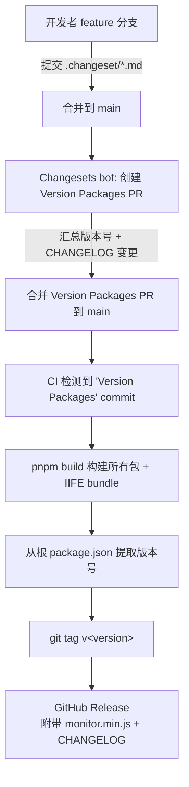
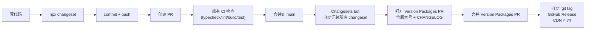

# Monitor SDK 发布与版本管理设计

> 补充 Changesets 驱动的发布流水线，实现统一版本管理、CHANGELOG 自动生成、GitHub Release + CDN 分发。

---

## 一、需求背景

Monitor SDK 是一个 pnpm Monorepo，含 16 个子包，当前所有包版本为 `0.0.0`，缺少：

- 版本号管理
- 变更日志 (CHANGELOG)
- Git tag / GitHub Release
- CDN 分发渠道

现阶段为内部试用，**暂不发布到 npm**，仅通过 GitHub Release 附带 IIFE bundle 作为 CDN 分发。

## 二、发布渠道

| 渠道 | 状态 | 说明 |
|------|------|------|
| npm (public) | 暂不接入 | 等外部可用时补一个 `pnpm publish -r` 步骤 + `NPM_TOKEN` |
| GitHub Release | 当前唯一发布渠道 | 附带 `monitor.min.js` (IIFE) 作为 CDN 资源 |

## 三、版本策略

### 统一版本 (Fixed Mode)

所有 14 个可发布包共享同一版本号，由 Changesets 的 `fixed` 配置统一管理。

固定版本包列表：

- `@monitor/config`
- `@monitor/core`
- `@monitor/protocol`
- `@monitor/sdk`
- `@monitor/transport`
- `@monitor/plugin-error`
- `@monitor/plugin-metric`
- `@monitor/plugin-page`
- `@monitor/plugin-perf-cache`
- `@monitor/plugin-perf-fsp`
- `@monitor/plugin-perf-ird`
- `@monitor/plugin-perf-shr`
- `@monitor/plugin-pv`
- `@monitor/plugin-resource`

排除包：`@monitor/build-config` 和 `@monitor/bundle` (`private: true`)。

### 预发布策略

当前处于 alpha 阶段：

```
v1.0.0-alpha.0 → v1.0.0-alpha.1 → ... → v1.0.0-alpha.N
```

每次合并 "Version Packages" PR 自动递增。

退出 alpha 进入正式版：

```bash
npx changeset pre exit
```

后续需要 beta/rc 时：

```bash
npx changeset pre enter beta   # → v1.0.0-beta.0
npx changeset pre enter rc     # → v1.0.0-rc.0
```

## 四、Changesets 配置

### `.changeset/config.json`

```json
{
  "changelog": "@changesets/cli/changelog",
  "commit": false,
  "fixed": [
    [
      "@monitor/config",
      "@monitor/core",
      "@monitor/protocol",
      "@monitor/sdk",
      "@monitor/transport",
      "@monitor/plugin-error",
      "@monitor/plugin-metric",
      "@monitor/plugin-page",
      "@monitor/plugin-perf-cache",
      "@monitor/plugin-perf-fsp",
      "@monitor/plugin-perf-ird",
      "@monitor/plugin-perf-shr",
      "@monitor/plugin-pv",
      "@monitor/plugin-resource"
    ]
  ],
  "private": true,
  "baseBranch": "main"
}
```

**关键设计决策：**

- `fixed` — 14 个包统一升降版本
- `private: true` — 暂不发布到 npm
- `commit: false` — Changesets bot 的 PR 自带 commit，CLI 不再重复提交
- `baseBranch: "main"` — 保护分支
- `changelog` — 使用默认格式

### 初始版本号

根 `package.json` 补 `"version": "1.0.0"`，14 个包 `package.json` 全部设为 `"version": "1.0.0"`。

初始化 prerelease 模式：

```bash
npx changeset init
npx changeset pre enter alpha
```

### package.json 补充

根 `package.json` 新增 changeset 常用脚本：

```json
{
  "scripts": {
    "changeset": "changeset",
    "version-packages": "changeset version",
    "release": "pnpm build && changeset publish"
  },
  "devDependencies": {
    "@changesets/cli": "^2.27.0"
  }
}
```

## 五、CI 发布 Workflow

### `.github/workflows/release.yml`

```yaml
name: Release

on:
  push:
    branches: [main]

jobs:
  release:
    if: contains(github.event.head_commit.message, 'Version Packages')
    runs-on: ubuntu-latest
    timeout-minutes: 10

    steps:
      - uses: actions/checkout@v5
      - uses: pnpm/action-setup@v6
      - uses: actions/setup-node@v4
        with:
          node-version: "22"
          cache: "pnpm"

      - run: pnpm install --frozen-lockfile
      - run: pnpm build

      # 取 sdk 包的版本号（fixed 模式保证所有 14 个包版本一致）
      - id: version
        run: echo "tag=$(node -e "console.log(require('./packages/sdk/package.json').version)")" >> $GITHUB_OUTPUT

      # 从 sdk 的 CHANGELOG 中截取最新版本段作为 Release 内容
      - id: changelog
        run: |
          awk '/^## /{if(++c==2) exit} c' packages/sdk/CHANGELOG.md > /tmp/release-body.md
          echo "body_file=/tmp/release-body.md" >> $GITHUB_OUTPUT

      - run: |
          git tag "v${{ steps.version.outputs.tag }}"
          git push origin "v${{ steps.version.outputs.tag }}"

      - uses: softprops/action-gh-release@v2
        with:
          tag_name: v${{ steps.version.outputs.tag }}
          body_path: ${{ steps.changelog.outputs.body_file }}
          files: packages/bundle/dist/monitor.min.js
```

### 触发流程



**关键设计决策：**

- 通过 commit message 含 `Version Packages` 判定发版 commit，避免每次 push 都跑
- git tag 前缀 `v`（如 `v1.0.0-alpha.0`）
- `softprops/action-gh-release@v2` — 最轻量的 GitHub Release action

## 六、开发者日常流程

### 提交流程

```bash
# 1. 写完代码后，创建 changeset
npx changeset
```

交互式 CLI：

```
🦋  What kind of change is this?
    ◯ patch  — 修复
    ◯ minor  — 新功能
    ◯ major  — 破坏性变更

🦋  Select packages:  ← 多选本次改动的包
🦋  Please enter a summary: ← 用中文写一句话描述
```

生成 `.changeset/<random-name>.md`：

```markdown
---
"@monitor/core": patch
"@monitor/plugin-error": patch
---

修复 XHR 超时后未清理回调的问题
```

与代码一起 commit 到 feature 分支。**日常 CI 不受影响**，changeset 文件只是普通文件。

> **约定**：changeset 中至少包含 `@monitor/sdk`，确保 SDK 的 CHANGELOG 能作为 GitHub Release 的主体内容。

### 开发全景



- 开发者不需要手工计算版本号
- CHANGELOG 由 changeset 内容自动拼合
- 多个 changeset 可以累积到一个版本里

## 七、CDN 访问

GitHub Release 提供两个固定访问路径：

### 固定版本（生产推荐）

```
https://github.com/<owner>/monitor/releases/download/v1.0.0-alpha.0/monitor.min.js
```

URL 包含版本号，不会因新发布而改变。

### 最新版本（内部开发测试）

```
https://github.com/<owner>/monitor/releases/latest/download/monitor.min.js
```

始终重定向到最新 Release。**不在生产使用**。

### 页面引入

```html
<!-- 内部验证 -->
<script src="https://github.com/<owner>/monitor/releases/latest/download/monitor.min.js"></script>

<!-- 生产（锁定版本） -->
<script src="https://github.com/<owner>/monitor/releases/download/v1.0.0-alpha.0/monitor.min.js"></script>
```

> GitHub Release 下载走 Fastly CDN，全球可用。

## 八、后续扩展

### npm 发布接入

当需要对外发布到 npm 时，修改两步：

1. `.changeset/config.json` 中 `"private": true` → `"access": "public"`
2. `.github/workflows/release.yml` 中追加：

```yaml
- run: pnpm publish -r --access public
  env:
    NODE_AUTH_TOKEN: ${{ secrets.NPM_TOKEN }}
```

3. 同时 `updateInternalDependencies` 改为 `"patch"`，使 workspace 协议在发布时转为 `^x.y.z`

### changelog body 来源

当前设计用 `packages/sdk/CHANGELOG.md` 作为 Release body。后续如果需要完整的跨包说明，可以改为用 action 合并所有包的 CHANGELOG 变更。

## 九、待办清单

- [ ] 根 + 14 个包 `package.json` 版本号统一为 `1.0.0`
- [ ] 安装 `@changesets/cli` 依赖
- [ ] 创建 `.changeset/config.json`
- [ ] 创建 `.github/workflows/release.yml`
- [ ] 执行 `changeset pre enter alpha`
- [ ] 提交初始 changeset，触发首次 alpha 发布验证
