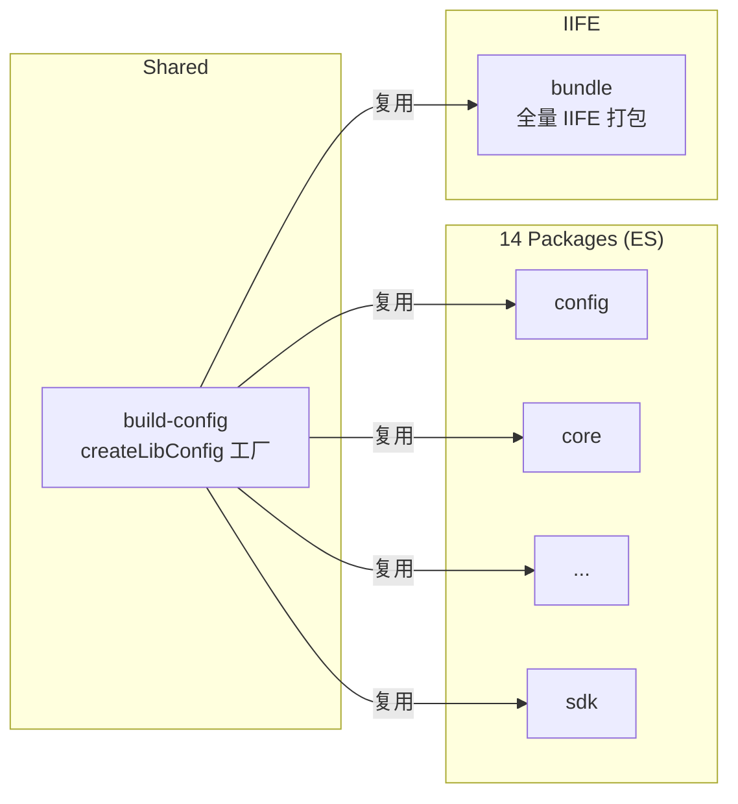

# Vite 8 迁移设计

> 日期：2026-07-01 | 状态：待实施

## 目标

将 Monitor SDK monorepo 从 Vite 5.4 迁移到 Vite 8，核心驱动力是**构建性能提升**（Rolldown Rust 引擎替代 esbuild+Rollup 双引擎）。

## 迁移力度

**深度改造** — 在升级依赖版本的基础上：
- 清理废弃 API
- 统一 14 个包的构建配置为共享工厂函数
- 去掉 CJS 输出，改为 ES + 全量 IIFE
- 新建 `build-config` 和 `bundle` 两个子项目

---

## 一、依赖升级

| 依赖 | 当前 | 目标 | 说明 |
|------|------|------|------|
| vite | `^5.4` | `^8.0` | Rolldown Rust 引擎，10-30x 构建加速 |
| vitest | `^2.0` | `^4.1` | Vite 8 兼容，原生 Node 执行、测试标签 |
| typescript | `^5.5` | `^7.0` | Go 编译器重写，类型检查 10x 加速 |
| @types/node | `^20.14` | `^22` | Node 22 LTS 对齐 |
| pnpm | `9.0.0` | 不变 | — |

> **Node.js 要求：** Vite 8 需要 Node.js 20.19+ 或 22.12+。当前 `@types/node@^22` 已对齐 Node 22 LTS。

---

## 二、项目结构

```
packages/
├── build-config/       # 🆕 共享构建工厂
│   ├── src/
│   │   └── index.ts              # createLibConfig() / resolveAlias
│   └── package.json
├── bundle/             # 🆕 全量 IIFE 打包入口
│   ├── src/
│   │   └── index.ts              # 聚合所有插件 + window.Monitor 挂载
│   ├── vite.config.ts
│   └── package.json
├── config/             # 现有 14 个包保持不变
├── core/
├── protocol/
├── transport/
├── sdk/
├── plugin-error/
├── plugin-pv/
├── plugin-metric/
├── plugin-resource/
├── plugin-page/
├── plugin-perf-fsp/
├── plugin-perf-ird/
├── plugin-perf-shr/
└── plugin-perf-cache/
```



---

## 三、共享构建工厂 `createLibConfig`

### 接口定义

```typescript
interface LibConfigOptions {
  name: string;                    // 全局变量名（仅 IIFE 使用）
  entry?: string;                  // 默认 "src/index.ts"
  external?: (string | RegExp)[];  // external 依赖
  formats?: ('es' | 'iife')[];     // 默认 ['es']
  iifeName?: string;               // IIFE 全局变量名
  outDir?: string;                 // 默认 "dist"
}
```

### 工厂行为

- `formats: ['es']` → 标准库模式，输出 `dist/index.js` + `dist/index.d.ts`
- `formats: ['iife']` → 输出 `dist/<iifeName>.min.js`，挂载到 `window`
- 内部使用 `rolldownOptions.external`（Vite 8 重命名）
- 路径别名从 `tsconfig.base.json` 的 paths 自动生成，不再每份配置手写
- 统一 sourcemap、declaration 生成策略

### 使用示例

```typescript
// packages/core/vite.config.ts（改后）
import { createLibConfig } from "@monitor/build-config";
export default createLibConfig({
  name: "MonitorCore",
  external: ["@monitor/config", "@monitor/protocol", "@monitor/transport"]
});

// packages/bundle/vite.config.ts
import { createLibConfig } from "@monitor/build-config";
export default createLibConfig({
  name: "Monitor",
  formats: ["iife"],
  iifeName: "Monitor",
  external: []
});
```

### 现有配置精简对比

以 `packages/core/vite.config.ts` 为例，从 15 行缩减到 6 行。路径别名从每份配置文件逐行手写 `new URL(...)` 变为从 tsconfig paths 自动解析。

### 关键 API 迁移

| Vite 5 (旧) | Vite 8 (新) |
|---|---|
| `build.rollupOptions` | `build.rolldownOptions` |
| `optimizeDeps.esbuildOptions` | 已废弃，移除 |
| esbuild 依赖 | 已废弃，自动移除 |
| `lib.formats: ["es", "cjs"]` | `lib.formats: ["es"]`（不再输出 CJS） |

---

## 四、IIFE 全量包 `bundle`

### 入口文件

```typescript
// packages/bundle/src/index.ts
import { Monitor } from "@monitor/sdk";

// 导入所有插件（触发副作用注册）
import "@monitor/plugin-error";
import "@monitor/plugin-pv";
import "@monitor/plugin-metric";
import "@monitor/plugin-resource";
import "@monitor/plugin-page";
import "@monitor/plugin-perf-fsp";
import "@monitor/plugin-perf-ird";
import "@monitor/plugin-perf-shr";
import "@monitor/plugin-perf-cache";

(window as any).Monitor = Monitor;
export { Monitor };
```

### 构建配置

- `formats: ['iife']`，`iifeName: "Monitor"`
- `external: []` — 全量打包，不排除任何依赖
- 输出：`dist/monitor.min.js`

### CDN 使用方式

```html
<script src="https://cdn.example.com/monitor.min.js"></script>
<script>
  window.Monitor.create({ project: "my-app" });
</script>
```

---

## 五、测试迁移

| 项目 | 当前 | 目标 |
|------|------|------|
| 测试运行器 | vitest@^2.0 | vitest@^4.1 |
| 工作区配置 | `vitest.workspace.ts` | 保持结构，别名改用 `build-config` 导出 |
| 断言 API | vitest 内置 | 不变，向后兼容 |

### Vitest 4.1 新特性（可选启用）

- `viteModuleRunner: false` — 原生 Node 执行，速度更快（要求 Node 22+）
- 测试标签 `test.tags` — 可按标签筛选测试
- 复用项目安装的 vite，不再捆绑副本

### `vitest.workspace.ts` 别名统一

当前文件中有手写的 `resolveAlias` 对象，改后从 `@monitor/build-config` 导入 `resolveAlias`，消除重复定义。

---

## 六、其他应用处理

### mock-server

Node.js 服务，不参与浏览器构建。仅升级其 tsconfig 引用和 devDependencies，不改变运行时行为。

### playground

浏览器验证应用：
- 确认 Vite 8 dev server + HMR 正常
- 代理配置不变
- resolve.alias 改用 `@monitor/build-config` 的 `resolveAlias`

---

## 七、风险与缓解

| 风险 | 可能性 | 缓解措施 |
|------|--------|----------|
| `rollupOptions` 配置在 `rolldownOptions` 下行为不同 | 中 | 对照 Vite 8 官方迁移指南逐项核对 |
| 现有插件不兼容 Rolldown | 低 | 当前项目无第三方 Vite/Rollup 插件，仅纯 lib 构建 |
| 类型声明生成行为变化 | 中 | 如 `vite-plugin-dts` 不兼容则改用 Rolldown 原生声明输出 |
| 构建产物体积变化 | 低 | Rolldown tree-shaking 比 Rollup 更激进，可能更小 |

### 回滚策略

- 全程在独立分支操作，`main` 不受影响
- 每完成一个包就验证构建 + 测试
- 如 Rolldown 出现阻塞性问题，回退到仅升级版本不做深度改造

---

## 八、迁移步骤

1. 创建 `packages/build-config`，实现 `createLibConfig()` 工厂和 `resolveAlias` 工具函数
2. 升级根目录依赖（vite、vitest、typescript、@types/node）
3. 逐个改造 14 个包的 `vite.config.ts`，改为使用工厂函数
4. 改造 `vitest.workspace.ts`，别名改用 `build-config` 导出
5. 改造 playground 的 vite.config.ts
6. 创建 `packages/bundle`，实现全量 IIFE 打包（`packages/*` 通配已覆盖，无需改 pnpm-workspace.yaml）
7. 运行 `pnpm install`
8. 全量 `pnpm build` + `pnpm test:run` 回归验证
9. 提交、code review
