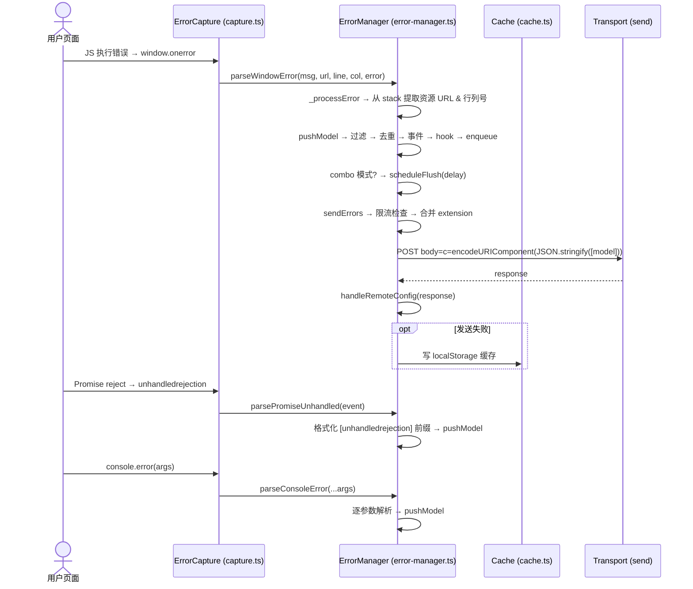
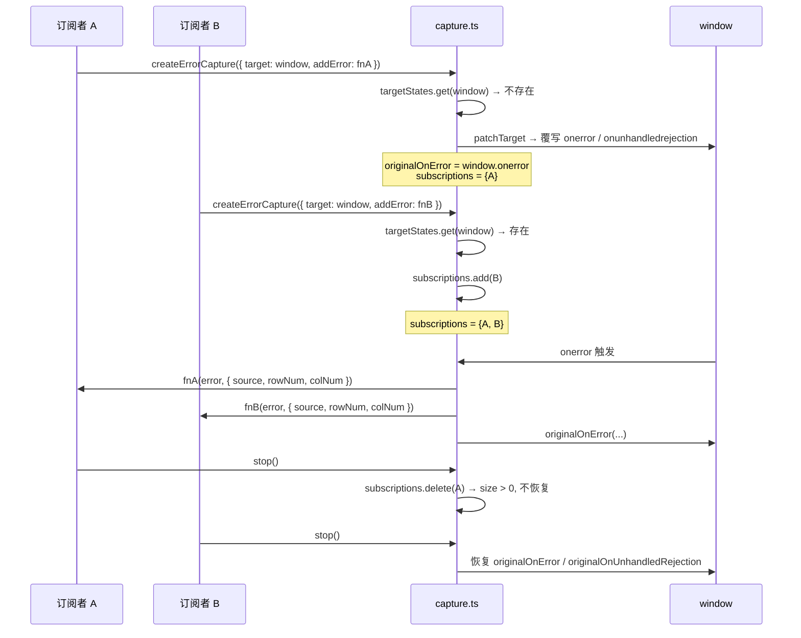
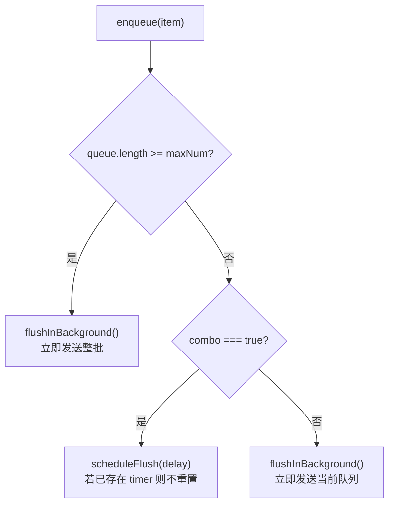
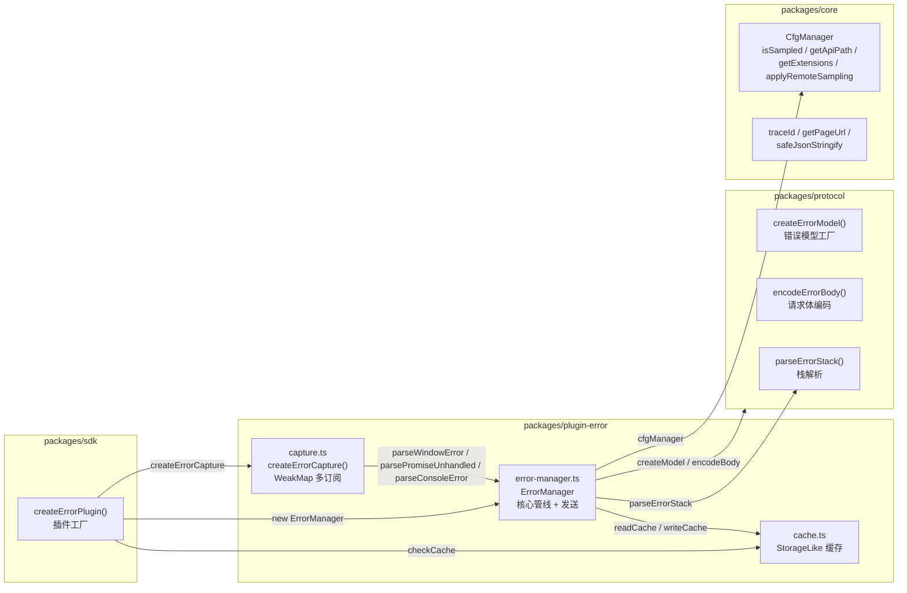
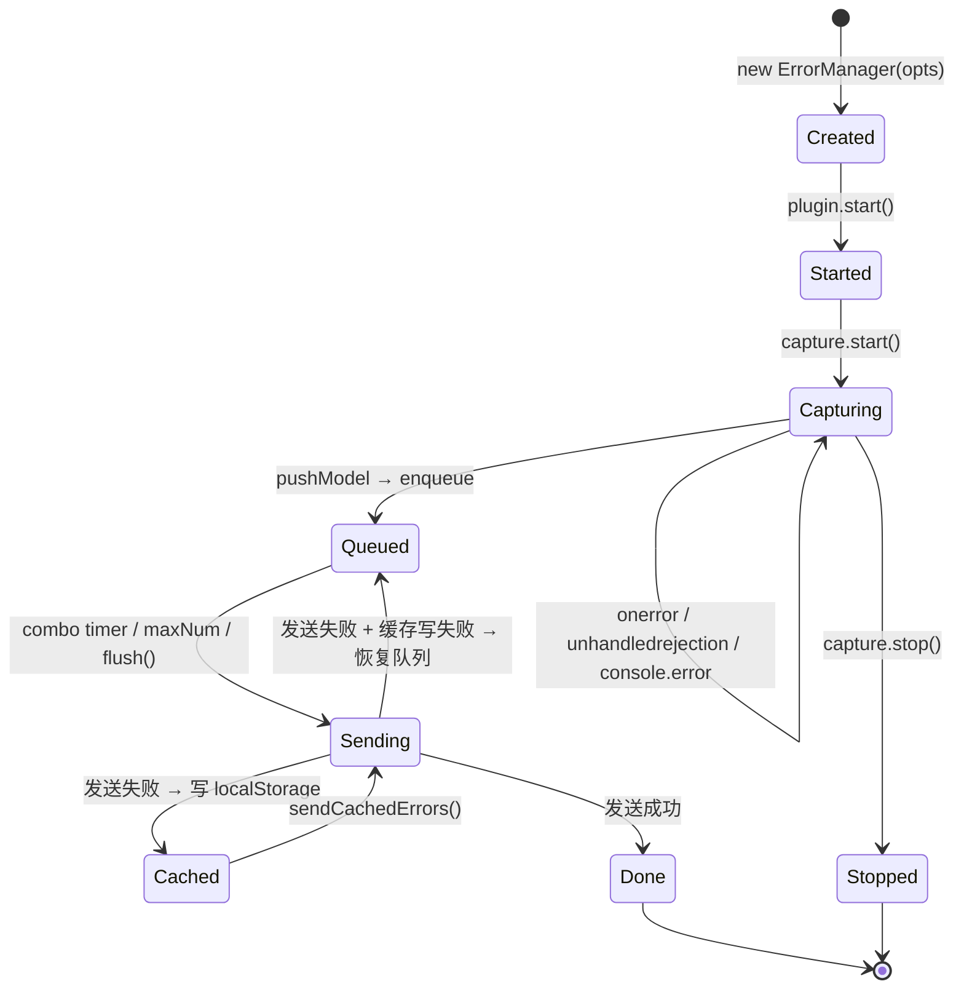

# plugin-error（错误监控）实现原理

## 概述

plugin-error 是 `@monitor/plugin-error` 的 JavaScript 错误监控插件。它负责全局捕获三类运行时错误——`window.onerror`（JS 执行错误）、`unhandledrejection`（未处理的 Promise 拒绝）和 `console.error`（控制台错误），经过过滤、去重、限流后批量上报至服务端。

该插件严格对齐 `refer/owl_1.13.5.js` 的 ErrorManager 模块，在核心行为（栈解析、限流、combo 延迟、`owlErrDetected` 事件、页面离开检测等）上保持一致，同时在架构上做了模块化拆分和可测试性增强。

---

## 核心原理

### 1. 整体流程



### 2. 事件捕获层（capture.ts）

`createErrorCapture()` 基于 **WeakMap 多订阅模式**，允许多个调用方共享同一 `window` / `console` 目标而不互相破坏：



#### 专用事件处理器

捕获层支持三种粒度的回调：

| 回调 | 对应 owl.js 方法 | 传递参数 |
|---|---|---|
| `onWindowError` | `parseWindowError` | `(msg, source, lineno, colno, error)` |
| `onUnhandledRejection` | `parsePromiseUnhandled` | `(event: PromiseRejectionEvent)` |
| `onConsoleError` | `parseConsoleError` | `(...args: unknown[])` |

若未提供专用处理器，回退到通用 `addError` 回调。

### 3. 错误解析（对齐 owl.js 三大入口）

#### 3.1 parseWindowError — JS 执行错误

```typescript
// 从 Error.stack 中正则提取资源 URL 和行列号
// owl.js: _processError + parseWindowError
parseWindowError(msg, url, line, col, error) {
  if (error?.stack) {
    const parsed = _processError(error);
    // resourceUrl: /https?:\/\/(\S)+\.js/
    // rowNum/colNum: /:(\d+):(\d+)/
    if (parsed.sec_category !== 'Invalid_Error') {
      补全 rowNum/colNum/resourceUrl → pushModel
    }
  } else if (typeof msg === 'string') {
    用 msg 构造模型 → pushModel
  }
}
```

#### 3.2 parsePromiseUnhandled — Promise 拒绝

```
event.reason instanceof Error → stack 取 err.stack
  formatUnhandledRejection=true → sec_category = "[unhandledrejection] ErrorMessage"
  formatUnhandledRejection=false → sec_category = "unhandledrejection"
event.reason 非 Error → content = reason.toString()
```

#### 3.3 parseConsoleError — 控制台错误

逐参数解析，支持 `string | Error | ErrorEvent | object` → `contents.join(" ")` → `sec_category = "consoleError"`。

### 4. 内部管线（pushModel）

每条错误在入队前经过完整的过滤链，对齐 owl.js 的 `push()` 方法：

```
pushModel(model)
  ├── isSampled("error")         ← 采样检查 (owl: isSampleHit)
  ├── applyFilters               ← beforeSend / filter 钩子
  ├── noScriptError              ← 过滤 "Script error" 前缀 (owl: noScriptError)
  ├── cfgManager.filters         ← 全局过滤器 (owl: filters 数组)
  ├── ignoreList (sec_category)  ← sec_category 前缀/正则匹配 (owl: ignoreList.js)
  ├── maxSize 检查              ← content.length >= maxSize → 丢弃 (owl: maxSize)
  ├── dispatchErrorEvent         ← owlErrDetected CustomEvent
  ├── isExist (内容去重)        ← sec_category + resourceUrl + rowNum + colNum + content
  ├── _handleError (onErrorPush) ← 可转换/丢弃 (owl: _handleError)
  └── enqueue                    ← 时间窗口去重 + 入队
```

#### 4.1 双重去重机制

| 层级 | 方式 | 用于 |
|---|---|---|
| **isExist**（内容去重） | 对比 `sec_category + resourceUrl + rowNum + colNum + content` | 当前队列内的完全重复（对齐 owl.js） |
| **isDuplicate**（时间窗口去重） | key=`category|sec_category|content`，`recent` Map 记录，`dedupeTime` 过期 | 短时间内相同错误的合并（对齐 owl.js 的 `isExist` + `recent` 组合） |

#### 4.2 onErrorPush Hook

对齐 owl.js 的 `_handleError`：在入队前最后一步，允许外部函数转换或丢弃错误模型：

```typescript
onErrorPush?: (model: ErrorModel) => ErrorModel | undefined;
// 返回 undefined → 丢弃
// 返回 ErrorModel → 替换
```

### 5. 队列调度与发送

#### 5.1 Combo 模式

对齐 owl.js 的 `combo` 开关和 `delay` 延迟合并：



#### 5.2 限流（Time-Window Rate Limiting）

严格对齐 owl.js 的窗口限流算法：

```
checkRateLimit():
  timeSinceStart = Date.now() - this.timeLimit   // ← 在重置前计算！
  if (!this.isTimeLimited):
    this.timeLimit = Date.now()                    // 重置窗口起点
  this.isTimeLimited = true
  this.errorCount += this.queue.length             // 累加本批数量
  if (timeSinceStart <= maxTime):
    if (this.errorCount - this.queue.length >= maxNum):  // 本批发送前已超限
      → LIMIT (丢弃队列)
  else:
    this.isTimeLimited = false                     // 窗口过期，重置
    this.errorCount = 0
```

关键细节：`timeSinceStart` 在 `this.timeLimit` 重置**之前**计算，保证首次调用时读取到的是构造函数距今的时间差，从而触发窗口重置——与 owl.js 完全一致。

#### 5.3 发送流程

```
sendErrors(isReportNow=true):
  clearFlushTimer
  if queue empty → return
  
  checkRateLimit → 限流则清空队列

  splice 队列 → batch
  addCacheExtension (合并 extension 数据) → 构建请求
  cacheSending.set(ts, { xhr, cache })             // 在途追踪

  try:
    response = await send(request)
    cacheSending.delete(ts)
    forgetQueueKeys(batch)
    handleRemoteConfig(response)                    // 处理服务端采样下发
  catch:
    写缓存失败 → 恢复队列
    throw
```

### 6. 页面离开检测（detectLeave）

对齐 owl.js 的 `detectLeave`，自动 patch `window.onbeforeunload`：

```
detectLeave():
  if 已注册 → return
  origin = window.onbeforeunload
  window.onbeforeunload = () =>
    1. 未进入上报的队列 → addCacheExtension 合并
    2. cacheSending 中的在途请求 → 合并
    3. sendBeacon 可用? → POST beacon
    4. 否则 disableCache=false? → 写 localStorage
    5. 调用原始 origin()
```

### 7. 缓存与版本化

#### 7.1 缓存读写

```
readErrorCache / writeErrorCache / appendErrorCache / clearErrorCache
  └── StorageLike 接口（默认 localStorage）
        └── key = __monitor_error_cache__[_webVersion]
```

- `StorageLike` 为泛型接口，支持注入自定义存储（非浏览器环境）
- 缓存 key 带 `webVersion` 后缀，不同版本互不干扰（对齐 owl.js 的版本化缓存）
- 所有读写操作 catch 异常，不向外抛

#### 7.2 延迟读取

对齐 owl.js 的 `checkCache`：插件启动后 **延迟 4000ms** 再读取并上报历史缓存，给页面足够的初始化时间。

#### 7.3 部分发送失败

`sendCachedErrors` 逐条发送缓存中的请求，若中间某条失败，**仅保留未发送的剩余条目**重写缓存。

### 8. SDK 自身错误上报（reportSystemError）

对齐 owl.js 的 `reportSystemError` / `reportSystemWarn`：

```
reportSystemError(err, opts):
  构造 ErrorModel (project="owl", sec_category = err.message || "parseError")
  → pushModel → sendErrors(true)
  // try/catch 静默处理，避免递归错误
```

### 9. owlErrDetected 自定义事件

对齐 owl.js：每条有效错误入队前，通过 `window.dispatchEvent` 广播 `owlErrDetected` CustomEvent，携带 `{ project, pageUrl, category, sec_category, level, unionId, pageId }`。支持 IE9 fallback（`document.createEvent`）。

### 10. 远程配置下发（handleRemoteConfig）

发送成功后检查响应 `body.sampling`，调用 `cfgManager.applyRemoteSampling()` 更新采样率，对齐 owl.js 的 `handleRemoteConfig`。

---

## 数据模型

```typescript
type ErrorFieldName =
  | "project" | "pageUrl" | "realUrl" | "resourceUrl"
  | "category" | "sec_category" | "level" | "unionId"
  | "timestamp" | "content" | "traceid";

type ErrorModel = Record<ErrorFieldName, string | number> & {
  dynamicMetric?: {
    rowNum?: number;
    colNum?: number;
    tags?: Record<string, string>;
  };
};
```

- `category` — `"jsError"` | `"ajaxError"` | `"resourceError"`
- `level` — `"error"` | `"warn"` | `"info"` | `"debug"`
- 发送编码：`c=${encodeURIComponent(JSON.stringify(models))}`，`Content-Type: application/x-www-form-urlencoded;charset=UTF-8`
- `rowNum` / `colNum` 仅在 SCRIPT 类型时写入 `dynamicMetric`（对齐 owl.js）

---

## 架构



### 核心模块

#### `ErrorManager`（error-manager.ts）

错误监控的核心状态机：

| 方法 | 职责 |
|---|---|
| `addError(errorLike, opts)` | 通用错误上报入口 |
| `parseWindowError(msg, url, line, col, err)` | 解析 `window.onerror` 错误 |
| `parsePromiseUnhandled(event)` | 解析 `unhandledrejection` 错误 |
| `parseConsoleError(...args)` | 解析 `console.error` 错误 |
| `report(errorLike, opts)` | 快捷上报 = addError + 立即发送 |
| `flush()` | 强制立即发送当前队列 |
| `sendErrors(isReportNow)` | 核心发送方法（限流 + combo） |
| `sendCachedErrors()` | 发送 localStorage 历史缓存 |
| `checkCache()` | 延迟 4000ms 读取历史缓存 |
| `handlePageLeave()` | 页面离开时的紧急发送 |
| `detectLeave()` | 自动注册 `beforeunload` 检测 |
| `reportSystemError(err, opts)` | SDK 自身错误上报 |
| `reportSystemWarn(err, opts)` | SDK 自身 warn 上报 |

#### `createErrorCapture()`（capture.ts）

事件捕获工厂，返回 `{ start(), stop() }` 对象：

- 多实例安全的 WeakMap 订阅
- 支持 `onWindowError` / `onUnhandledRejection` / `onConsoleError` 专用回调
- stop 后自动恢复原始 `window.onerror` / `window.onunhandledrejection`

#### `createErrorPlugin()`（sdk/src/error-plugin.ts）

SDK 层的插件工厂：

- 创建 `ErrorManager` + `ErrorCapture`
- 将捕获层的专用回调路由到 `ErrorManager` 的对应解析方法
- 启动时调用 `checkCache()` + `detectLeave()`

---

## 生命周期



---

## 关键配置（ErrorConfig）

| 配置项 | 默认值 | 说明 |
|---|---|---|
| `sample` | `1` | 采样率 |
| `maxQueueLength` | `20` | 队列达到即触发发送 |
| `noScriptError` | `true` | 过滤 "Script error" 开头错误 |
| `formatUnhandledRejection` | `false` | 为 unhandled rejection 名称加 `[unhandledrejection]` 前缀 |
| `combo` | `false` | 是否启用延迟合并（true = 等 delay 后批量发，false = 每条立即发） |
| `delay` | `1000` | combo 延迟 (ms) |
| `maxNum` | `100` | 时间窗口内最大错误数 |
| `maxTime` | `60000` | 限流窗口时长 (ms) |
| `maxSize` | `10240` | 单条 content 最大长度（>= 即丢弃，对齐 owl.js） |
| `disableCache` | `true` | 是否禁用 localStorage 缓存 |
| `ignoreList` | `[]` | 忽略列表（string 前缀匹配 / RegExp） |
| `maxRepeat` | `5` | 最大重复次数（预留） |

---

## 与 owl.js 的差异

| 维度 | owl.js | plugin-error | 说明 |
|---|---|---|---|
| 架构 | 单体 `ErrorManager` 类，耦合全局变量 | 三模块拆分（capture / cache / error-manager），依赖注入 | 可独立启停、替换、测试 |
| 事件捕获 | 直接覆写 `window.onerror`，不可逆 | `createErrorCapture` 基于 WeakMap 多订阅，stop 恢复 | 多实例安全 |
| 多实例 | 单一全局实例 (`SysInstance`) | 每次 `createErrorPlugin()` 创建独立实例 | 天然支持多实例 |
| 生命周期 | 无显式启停 | `start()`/`stop()` + `capture.start()`/`capture.stop()` | 运行时可动态控制 |
| 栈解析 | 内联正则提取 resourceUrl / rowNum / colNum | `parseErrorStack()` 独立函数（`@monitor/protocol`） | 可复用、可单独测试 |
| 去重 | 仅 `isExist` 内容去重（遍历队列） | 双重：`isExist` 内容去重 + `isDuplicate` 时间窗口去重 | 更精细的重复控制 |
| 过滤链 | `noScriptError` → `filters[]` → `ignoreList.js` → `onErrorPush` | 扩展为 `beforeSend` / `filter` / `noScriptError` / `filters` / `ignoreList` / `onErrorPush` 六层 | 更丰富的过滤能力 |
| 限流 | 内嵌在 `send()` 的 `comboReport` 闭包中 | `checkRateLimit()` 独立方法 | 逻辑清晰、可测试 |
| 发送方式 | 内联 `doSend` → `Ajax`（耦合 XHR） | `TransportRequest` 抽象 → `transport.send()` | 传输层可替换 |
| 缓存 | `DB` 模块，webVersion 分桶 | `StorageLike` 接口 + key 带 webVersion | 支持非浏览器环境 |
| 缓存读取时机 | 延迟 4000ms | 延迟 4000ms（`checkCache()`） | 行为对齐 |
| 页面离开 | 自动 patch `window.onbeforeunload` | `detectLeave()` + 显式 `handlePageLeave()` | 两种方式可选 |
| 远程配置 | `success: cfgManager.handleRemoteConfig(res)` | `sendErrors` 成功后调用 `handleRemoteConfig(response)` | 行为对齐 |
| 自定义事件 | `owlErrDetected` CustomEvent + IE9 polyfill | `dispatchErrorEvent()` + IE9 fallback | 行为对齐 |
| SDK 自身错误 | `reportSystemError` / `reportSystemWarn` → SysInstance | 同名方法 → 自身 `addError` 管线 | 行为对齐 |
| 单条长度限制 | `content.length >= maxSize` → 丢弃 | 同 owl.js | 行为对齐 |
| `report()` 方法 | `push() + send(true)` | `addError() + sendErrors(true)` | 行为对齐 |
| 类型安全 | JavaScript（无类型） | TypeScript（完整类型） | 编译时保证 |
| 测试覆盖 | - | 23 个单元测试 | 覆盖所有核心流程 |

### 未对齐项（有意设计差异）

| 差异 | 说明 |
|---|---|
| Logan 日志 | 明确排除，`toLoganJson` / `Logan._log` 不实现 |
| 资源错误 | 由独立 `plugin-resource` 包负责，`_pushResource` 不在此插件 |
| `SysInstance` | 新架构无全局单例概念，`reportSystemError` 通过自身管线自上报 |
| `xhrRewritten` | 传输层抽象自动处理 XHR 重写，无需显式传参 |
| `combo` 默认值 | owl 为概念上的隐式默认，新架构显式 `combo: false` |
| `traceid` 字段 | 新增字段，owl.js 无 |

---

## 文件结构

```
packages/plugin-error/
├── src/
│   ├── index.ts                  # 模块入口（re-export）
│   ├── capture.ts                # createErrorCapture() 事件捕获工厂
│   ├── capture.test.ts           # 事件捕获单元测试 (3 个)
│   ├── cache.ts                  # StorageLike 缓存读写
│   ├── cache.test.ts             # 缓存单元测试 (6 个)
│   ├── error-manager.ts          # ErrorManager 核心类
│   ├── error-manager.test.ts     # ErrorManager 单元测试 (23 个)
├── package.json
├── tsconfig.json
├── vite.config.ts
└── vitest.config.ts

packages/protocol/src/
└── error.ts                      # createErrorModel / encodeErrorBody / parseErrorStack

packages/sdk/src/
└── error-plugin.ts               # createErrorPlugin() SDK 插件工厂
```
