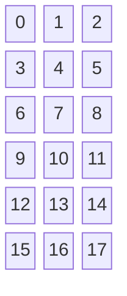
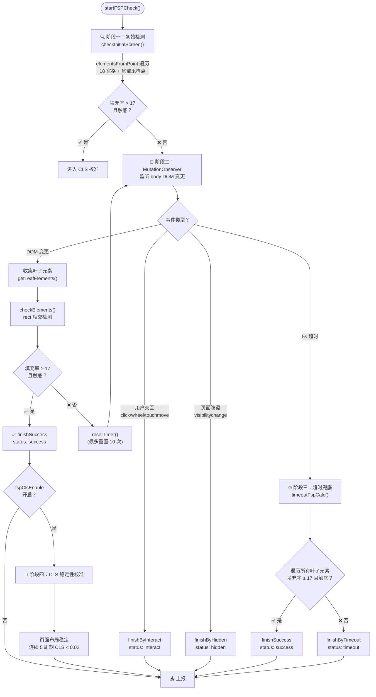
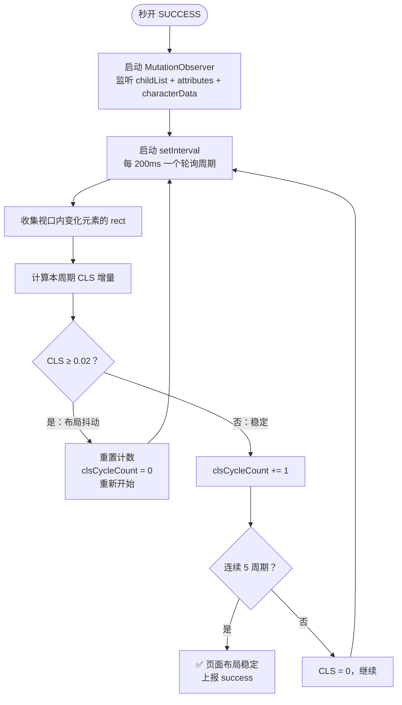
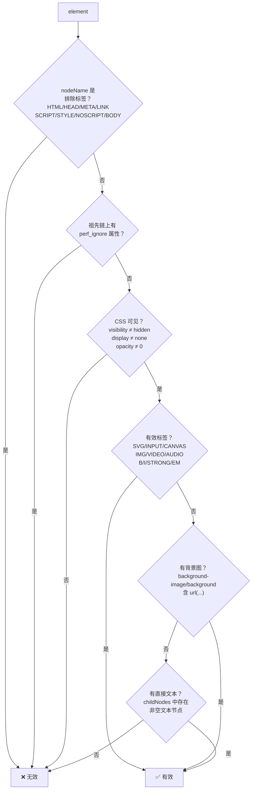
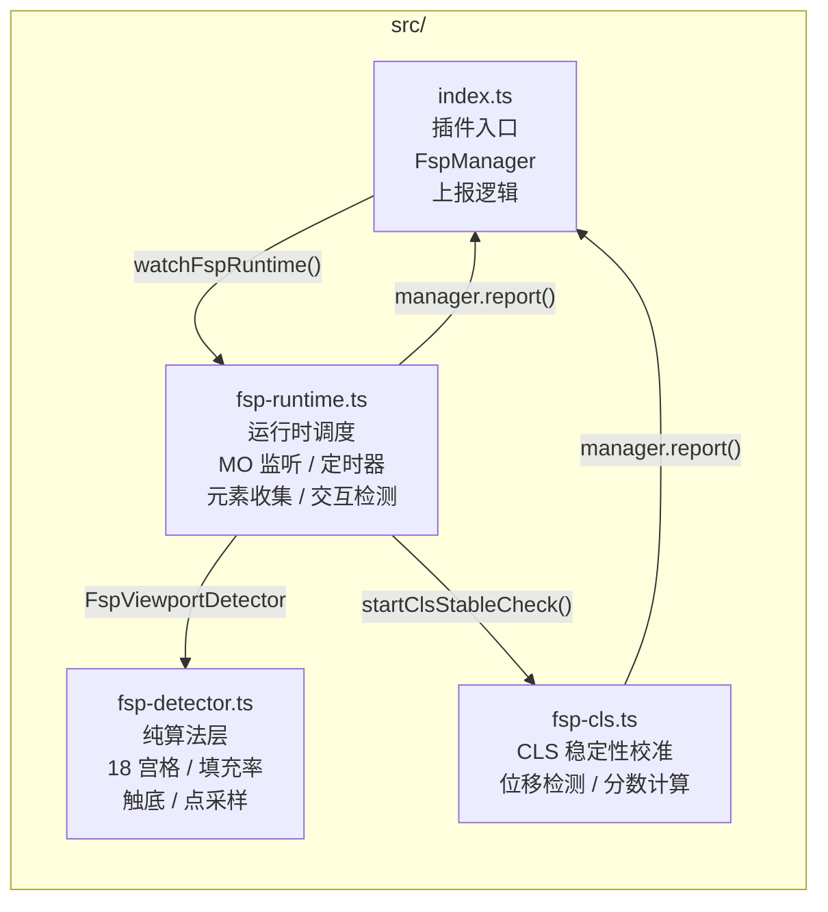

# FSP（秒开）实现原理

## 概述

FSP（First Screen Paint，即"秒开"）是一种**首屏渲染完成检测算法**。与传统的基于固定时间点（如 `DOMContentLoaded`、`load` 事件）的检测方式不同，FSP 通过**视口内容填充率**和**视觉触底**两个维度，动态判断页面首屏内容是否渲染完毕。

---

## 核心原理

### 1. 视口 18 宫格模型

将用户视口（viewport）划分为 **3 列 × 6 行 = 18 个等大宫格**：



> 视口宽度 = 宫格宽度 × 3 &emsp; 视口高度 = 宫格高度 × 6

每个宫格跟踪其"已填充"状态——当有可见内容元素与该宫格区域相交时，该宫格标记为 `filled`。

### 2. 两个判定条件

首屏渲染完成需同时满足：

#### 条件一：填充率 ≥ 17/18（≈94.4%）

18 个宫格中至少 **17 个**被内容元素覆盖。这意味着视口绝大部分区域已有可见内容。

**初始检测**（静态页面 / SSR 场景）使用更严格的标准：要求全部 **18/18** 宫格被填充（`> 17`），因为初始检测采用 `elementsFromPoint` 点采样方式，精度低于 bounding-rect 相交检测。

#### 条件二：内容触底

视口底部 **50px** 高度区域内存在可见内容元素。这表示页面内容已经延伸到视口底部，不再有"空白区域"等待加载。

触底判定逻辑：`元素上边界 ≤ 视口高度` ∧ `元素下边界 ≥ 视口高度 - 50px`

---

## 检测流程



### 阶段一：初始检测（`checkInitialScreen`）

针对**静态页面**和 **SSR 页面**（页面加载时 body 中已有完整内容）的快速路径。

1. 对 18 个宫格，每个宫格内采样 3×3 = 9 个坐标点
2. 调用 `document.elementsFromPoint(x, y)` 检查每个点
3. 通过 `isValidElement()` 判断点上的元素是否为有效视觉元素
4. 任意一个采样点有效 → 该宫格标记为 filled
5. 对 9 个底部采样点做同样的检测

如果填充率 > 17 **且**触底 → 秒开成功，直接上报。

### 阶段二：MutationObserver 动态检测

初始检测未通过时，启动 `MutationObserver` 监听 body 的 DOM 变更：

- **监听范围**: `document.body`
- **监听类型**: `childList`、`subtree`、`characterData`
- **过滤策略**: 排除 `SCRIPT`、`STYLE`、`META`、`LINK`、`HEAD`、`HTML`、`NOSCRIPT` 等非视觉节点

每次 DOM 变更时：

1. 收集新增/变更的叶子元素（`getLeafElements`）
2. 通过 `checkElements()` 检测每个元素：
   - **填充率检查**: 用元素的 `getBoundingClientRect()` 与每个未填充宫格做矩形相交检测
   - **触底检查**: 用元素 rect 判断是否进入底部 50px 区域
3. 任一条件首次满足时记录时间戳（用于后续计算秒开时长）

### 阶段三：超时兜底（`finishByTimeout`）

5 秒内无 DOM 变更（或前 10 次变更后仍未满足条件）时触发：

1. 遍历 `document.body` 下所有叶子元素
2. 对每个元素执行填充率和触底检查
3. 如满足条件 → 上报成功（`status: "success"`）
4. 如不满足 → 上报超时（`status: "timeout"`），强制标记完成

**纯静态页面特殊处理**: 如果超时检测成功且 `mutationCount === 0`（从未发生 DOM 变更），使用初始时间戳作为 `pageLoadedTime`，。

### 阶段四：CLS 稳定性校准

秒开 SUCCESS 后，如果启用了 `fspClsEnable`（默认开启），启动 CLS（Cumulative Layout Shift）稳定性检测：



CLS 计算公式：

```
单次位移比率  = max(|Δleft| / viewportWidth, |Δtop| / viewportHeight)
受影响面积比 = 变化区域与视口的交集面积 / 视口面积
CLS 增量     = 受影响面积比 × 单次位移比率
```

CLS 校准后的上报数据额外包含：

| 字段 | 含义 |
|------|------|
| `ffp_page_loaded` | 是否满足填充+触底 |
| `ffp_loaded_time` | 首次达标时间 |
| `ffp_page_stable` | 页面布局是否稳定 |
| `ffp_loaded_stable_gap` | 从加载完成到布局稳定的间隔（ms） |

---

## 元素有效性判断（`isValidElement`）

判断一个 DOM 元素是否为"有效视觉内容"：



**性能优化**:

- 使用 `Map<Element, boolean>` 缓存 `isValidElement()` 结果，避免对同一元素重复调用 `getComputedStyle`
- 使用 `__fspIgnored` 属性在 DOM 元素上缓存 `shouldIgnoreElement()` 的祖先遍历结果

---

## 关键常量

| 常量 | 值 | 说明 |
|------|------|------|
| `X_CUBE_NUM` | 3 | X 轴宫格数 |
| `Y_CUBE_NUM` | 6 | Y 轴宫格数 |
| `CUBE_COUNT` | 18 | 总宫格数 |
| `FILL_CUBE_NUM` | 17 | 填充率达标阈值（≥17/18） |
| `BOTTOM_SIZE` | 50 | 底部检测区域高度（px） |
| `BOTTOM_POINT_NUM` | 9 | 底部采样点数 |
| 宫格内采样点 | 3×3 = 9 | 每个宫格初始检测时的采样密度 |
| 超时时间 | 5000ms | DOM 变更静默超时 |
| 最大重置次数 | 10 | 前 10 次 DOM 变更可重置计时器 |
| CLS 轮询周期 | 200ms | CLS 稳定性检测间隔 |
| CLS 阈值 | 0.02 | CLS 超标阈值 |
| CLS 最大周期 | 5 | 连续稳定周期数 |

---

## 上报状态

| 状态 | 含义 |
|------|------|
| `start` | 秒开检测开始 |
| `success` | 秒开检测成功（满足填充+触底，且 CLS 稳定） |
| `timeout` | 超时未满足条件，兜底上报 |
| `hidden` | 页面退入后台，停止检测 |
| `interact` | 用户交互（click/wheel/touchmove），提前终止检测 |
| `notsupport` | 环境不支持（缺少 `elementsFromPoint` / `MutationObserver`） |
| `error` | 检测过程中发生异常 |

---

## 与 的差异及对齐

| 维度 | | plugin-perf-fsp | 对齐情况 |
|------|--------|------------------|----------|
| 初始检测阈值 | `> 17`（需 18/18） | `> 17`（需 18/18） | ✅ 已对齐 |
| 动态检测阈值 | `>= 17` | `>= 17` | ✅ 一致 |
| 超时 pageLoadedTime | 区分 mutationCount=0 情况；用首次达标时间 | 区分 mutationCount=0 情况；保留首次达标时间 | ✅ 已对齐 |
| CLS 视窗尺寸 | `clientWidth/clientHeight` | `clientWidth/clientHeight`（优先） | ✅ 已对齐 |
| 元素合法性缓存 | `elementValidationMap` | `Map<Element, boolean>` | ✅ 已对齐 |
| shouldIgnore 缓存 | `__fspIgnored` 属性 | `__fspIgnored` 属性 | ✅ 已对齐 |
| defer body 检查 | 检查 body 存在性 | 检查 body 存在性 | ✅ 已对齐 |
| containerBridge key | 3 个 key | 4 个 key（多 `bridge`） | 🟡 增强 |

---

## 架构



- **`fsp-detector.ts`** 是纯算法实现，不依赖 DOM API，通过参数注入方式接收运行时数据，便于单元测试
- **`fsp-runtime.ts`** 负责与浏览器 API 交互（MutationObserver、addEventListener、elementsFromPoint），编排检测流程
- **`fsp-cls.ts`** 在秒开成功后独立运行，检测布局稳定性
- **`index.ts`** 作为插件入口，管理上报、采样、桥接等
