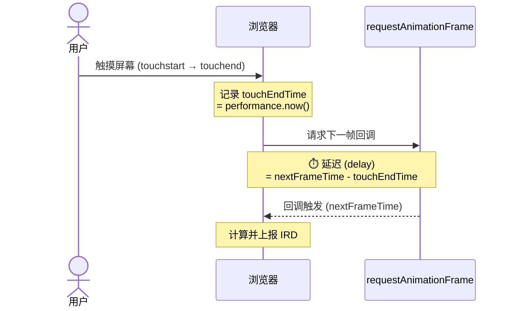
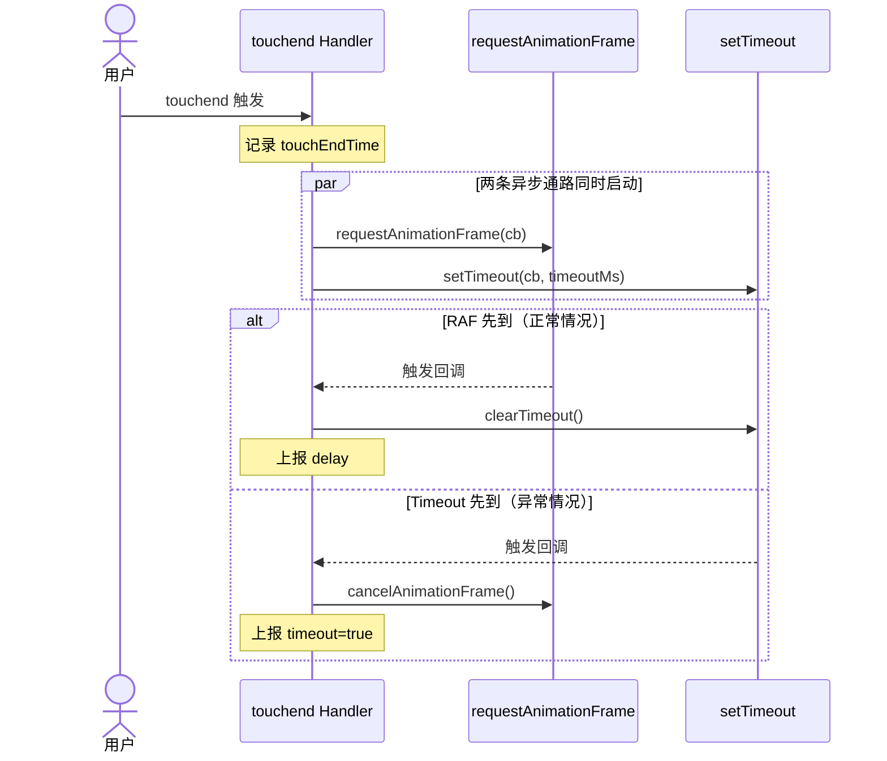
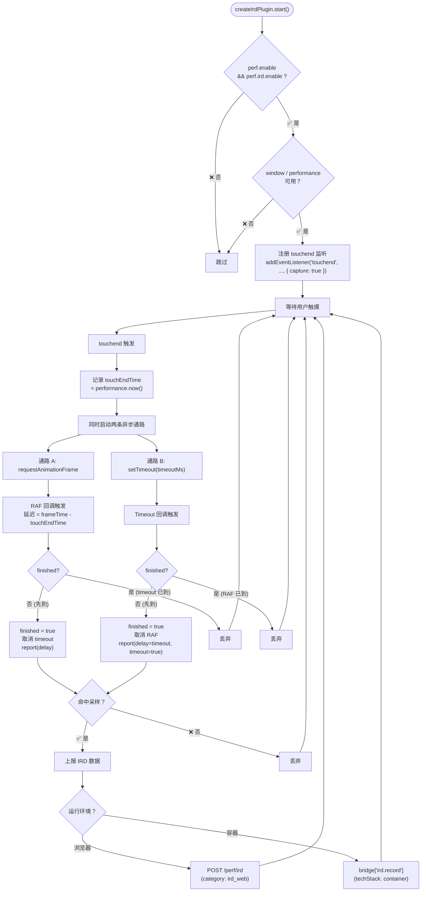
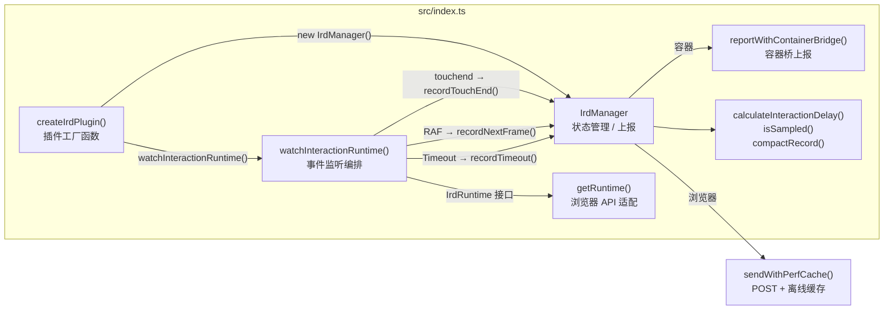

# IRD（交互响应耗时）实现原理

## 概述

IRD（Interaction Response Delay，交互响应耗时）是一种衡量用户交互响应速度的性能指标。它通过测量用户触摸屏幕（`touchend`）到浏览器开始渲染下一帧（`requestAnimationFrame`）之间的时间差，来量化用户感知到的交互延迟。

与 INP（Interaction to Next Paint）等标准指标不同，IRD 专注于**移动端触摸交互的端到端响应时间**，适用于 H5 页面和容器（WebView）场景。

该算法参考 `refer/owl_1.13.5.js` 实现，在核心思路上保持一致，同时在健壮性、可测试性和可配置性方面做了增强。

---

## 核心原理

### 1. 测量窗口

IRD 测量的是从用户触摸结束到浏览器准备好渲染下一帧的时间差：



- **起点**（`touchEndTime`）：`touchend` 事件触发时，通过 `performance.now()` 记录的时间戳
- **终点**（`nextFrameTime`）：下一次 `requestAnimationFrame` 回调的参数（即浏览器计划渲染该帧的时间）
- **延迟**：`Math.max(0, nextFrameTime - touchEndTime)`，取非负值防止时钟异常

```typescript
export function calculateInteractionDelay(touchEndTime: number, nextFrameTime: number): number {
  return Math.max(0, nextFrameTime - touchEndTime);
}
```

### 2. 超时机制

如果 `requestAnimationFrame` 在指定时间内未触发（例如页面进入后台、主线程长时间阻塞），系统会通过超时机制兜底上报：



- 默认超时时间：3000ms（3 秒），可通过配置调整
- 使用 `finished` 标志位防止 timeout 和 RAF 的竞态——**两者的回调只会执行其中一个**
- 超时上报时附带 `timeout: true` 标记，便于数据分析和问题排查

### 3. 竞态防重机制

```typescript
let finished = false;

// 超时通路
const timeout = setTimeout(() => {
  if (finished) return;          // RAF 已先触发，跳过
  finished = true;
  cancelAnimationFrame(rafId);   // 取消未触发的 RAF
  manager.recordTimeout();       // 上报超时
}, timeoutMs);

// RAF 通路
const rafId = requestAnimationFrame((time) => {
  if (finished) return;          // timeout 已先触发，跳过
  finished = true;
  clearTimeout(timeout);         // 取消未触发的 timeout
  manager.recordNextFrame(time); // 上报正常延迟
});
```

---

## 检测流程



---

## 上报数据格式

### 浏览器环境

向配置的 endpoint 发送 POST 请求，数据格式为 `@monitor/protocol` 的 `PerfCustomPayload`：

```json
{
  "category": "ird_web",
  "env": {
    "project": "my-project",
    "pagePath": "/home",
    "customTag1": "value1"
  },
  "logs": [
    {
      "delay": 48,
      "touchEnd": 100,
      "nextFrame": 148
    }
  ]
}
```

| 字段 | 类型 | 含义 |
|------|------|------|
| `category` | string | 固定 `"ird_web"` |
| `env` | object | 环境信息（project、pagePath、customTags 等） |
| `logs[].delay` | number | 交互响应耗时（ms），timeout 时等于超时时间 |
| `logs[].touchEnd` | number | `touchend` 时间戳（ms） |
| `logs[].nextFrame` | number | 下一帧时间戳（ms） |
| `logs[].timeout` | boolean? | 是否为超时上报（仅超时时存在，值为 `true`） |

### 容器环境（通过桥上报）

```json
{
  "pagePath": "/home",
  "techStack": "container",
  "value": 48,
  "tags": {
    "appId": "my-project",
    "$sr": 1.0,
    "gatherSource": "js",
    "project": "my-project",
    "pagePath": "/home"
  }
}
```

| 字段 | 类型 | 含义 |
|------|------|------|
| `value` | number | 延迟值（ms） |
| `techStack` | string | 固定 `"container"` |
| `tags.$sr` | number | 采样率（0-1），供服务端分析 |
| `tags.gatherSource` | string | 固定 `"js"`，标识采集来源 |
| `tags.appId` | string | 项目标识 |

---

## 采样机制

IRD 使用简单的概率采样来降低数据量：

```typescript
function isSampled(sample = 1, random: () => number = Math.random): boolean {
  return sample >= 1 || random() < sample;
}
```

- 采样率范围：`0` ~ `1`（0 = 不采样，1 = 全量上报）
- 默认值：`1`（全量）
- `random` 参数可注入（默认 `Math.random`），便于单元测试

每次 `recordNextFrame` 被调用时判断采样，未命中采样的数据直接丢弃。

---

## 架构



### 核心模块

#### `IrdManager`
- 管理交互状态（`touchEndTime`）
- 提供三个记录方法：`recordTouchEnd()`、`recordNextFrame()`、`recordTimeout()`
- 统一上报入口 `report()`，根据运行环境分发到 HTTP 或容器桥
- 构造上报数据（请求体 / 桥事件）

#### `watchInteractionRuntime()`
- 通过 `IrdRuntime` 接口注册 `touchend` 事件监听
- 编排 RAF 和 Timeout 的竞态逻辑
- 使用 `{ capture: true }` 在捕获阶段监听，避免子元素阻止冒泡导致漏报
- 返回 `stopWatch` 清理函数，用于插件 `stop()` 时移除监听

#### `IrdRuntime` 接口
抽象浏览器 API，便于测试和跨平台适配：

```typescript
export interface IrdRuntime {
  addEventListener: (type: "touchend", listener: () => void, options?: AddEventListenerOptions) => void;
  removeEventListener: (type: "touchend", listener: () => void) => void;
  requestAnimationFrame: (callback: (time: number) => void) => number;
  cancelAnimationFrame?: (id: number) => void;
  setTimeout: (callback: () => void, delay: number) => ReturnType<typeof setTimeout>;
  clearTimeout: (timer: ReturnType<typeof setTimeout>) => void;
  now: () => number;
}
```

#### `getRuntime()`
默认运行时实现，绑定浏览器全局 API：
- `addEventListener` → `window.addEventListener`
- `requestAnimationFrame` → `window.requestAnimationFrame`
- `now` → `performance.now`

在 `window` 或 `performance` 不可用时返回 `undefined`，优雅降级。

---

## 调试日志

插件支持通过 `ConsoleLike` 接口注入日志器。启用后会在关键节点输出日志：

| 日志 | 时机 | 内容 |
|------|------|------|
| `[ird] config` | 插件初始化 | 采样率、超时时间、endpoint、项目名 |
| `[ird] observer --功能开启` | 开始监听 touchend | — |
| `[ird] 交互响应时间:` | RAF 正常触发 | 延迟值（ms） |
| `[ird] 交互响应超时` | 超时触发 | — |
| `[ird] handleTouchEnd observer error:` | touchend 处理异常 | 异常信息 |
| `ird report result` | 容器桥上报成功 | 桥返回结果 |
| `ird report error:` | 容器桥上报失败 | 错误信息 |

---

## 关键常量

| 常量 | 默认值 | 说明 |
|------|--------|------|
| 默认采样率 | 1（100%） | `perf.ird.sample`，0-1 范围 |
| 默认超时 | 3000ms | `perf.ird.timeout` |
| 上报分类 | `"ird_web"` | 浏览器环境 category |
| 容器桥键 | `"ird.record"` | 容器桥方法名 |
| 容器 techStack | `"container"` | 容器环境下标识技术栈 |

---

## 与 owl.js 的差异

| 维度 | owl.js (`PluginIrd`) | plugin-perf-ird | 说明 |
|------|----------------------|-----------------|------|
| 采样率语义 | 0-100 范围（5=5%） | 0-1 范围（1=100%） | 更直观的 0-1 小数 |
| 事件捕获 | `capture: true` | `capture: true` | ✅ 已对齐，在捕获阶段监听 |
| 防重复机制 | 无 | `finished` 标志位 | 防止 timeout 和 RAF 竞态导致重复上报 |
| 延迟计算 | `endTime - startTime`（可能负值） | `Math.max(0, ...)` | 防止负值 |
| 超时标记 | 无 | `timeout: true` 字段 | 可区分超时数据和正常数据 |
| 离线缓存 | 无 | `PerfCache` 支持 | 无网络时数据不丢失 |
| 可测试性 | 依赖全局 `window` | `IrdRuntime` 接口注入 | 全部 6 个单元测试通过 mock runtime |
| 运行时优雅降级 | 硬依赖 `window.requestAnimationFrame` | 检查 `window` / `performance` 可用性 | SSR / 非浏览器环境安全 |
| 调试日志 | `logger.log` 内置 | `ConsoleLike` 可选注入 | 按需启用，生产环境零开销 |
| 容器 techStack | `"knb"` | `"container"` | 适配当前容器桥规范 |
| 错误处理 | try-catch in handleTouchEnd | try-catch in onTouchEnd | ✅ 已对齐 |
| 容器桥回调 | `success`/`fail` | `success(result)`/`fail(error)` | ✅ 已对齐，并增加了日志 |
| 架构模式 | OOP 类继承 `BasePlugin` | 函数式工厂 + plugin 协议 | 更灵活的组合方式 |
