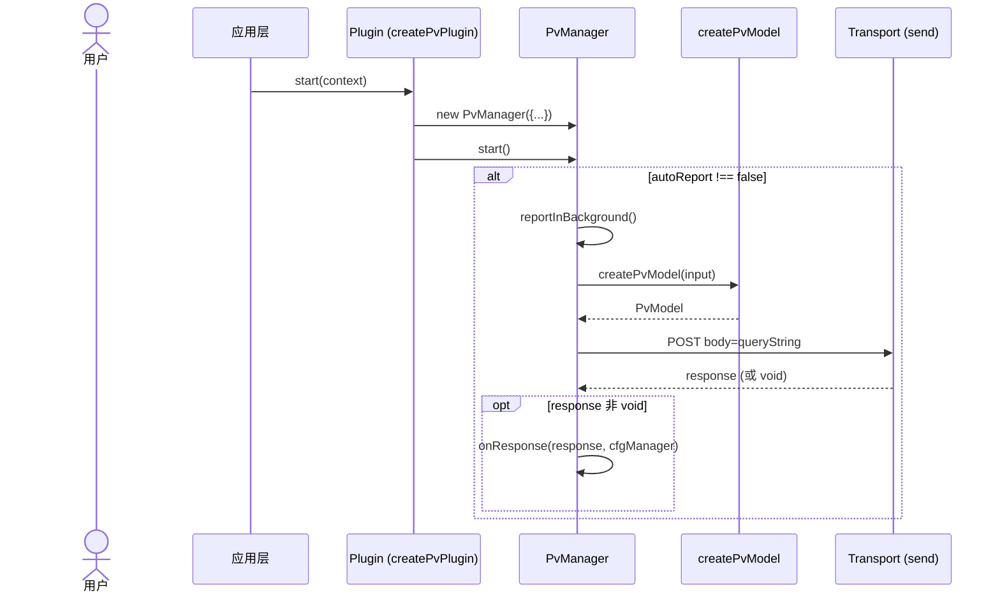
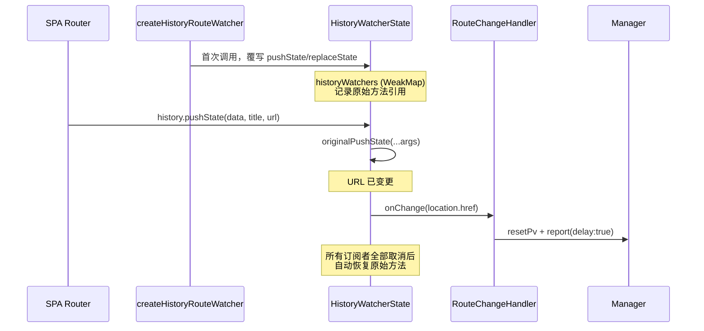
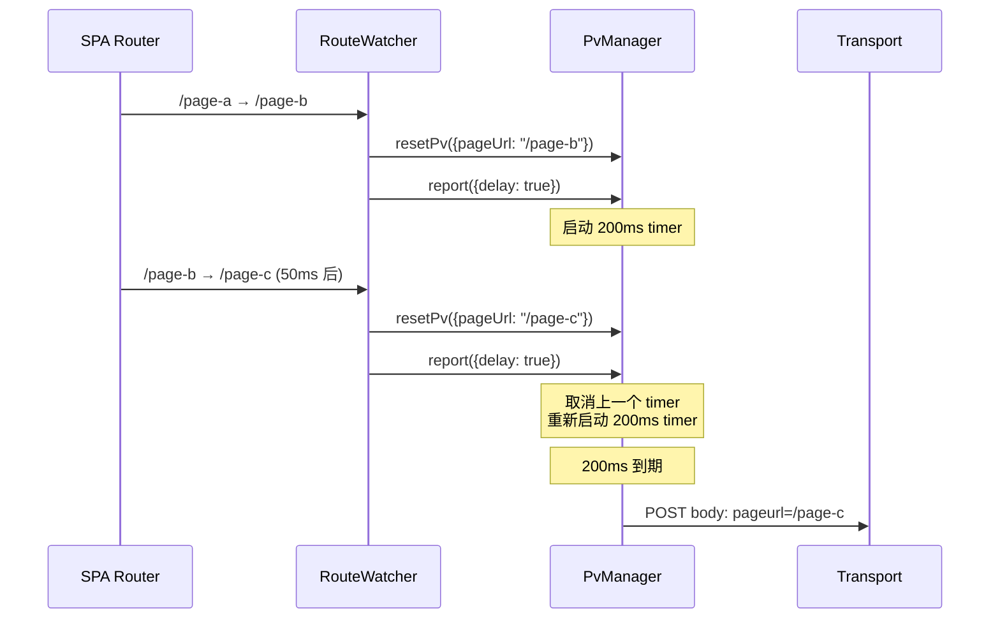
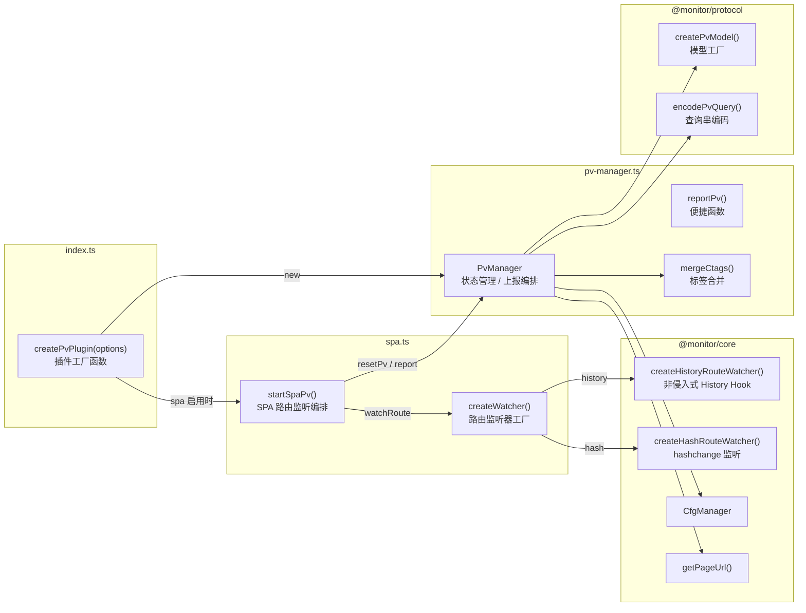
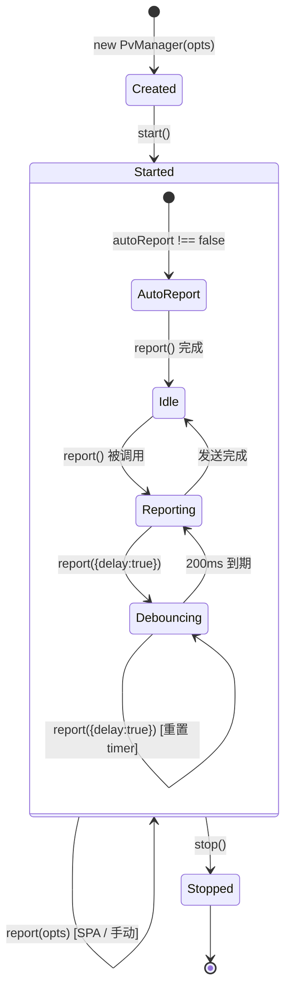
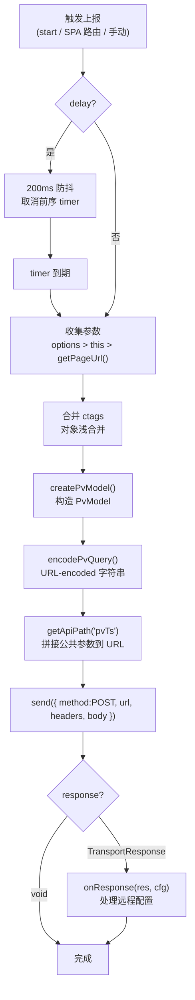

# plugin-pv（页面浏览）实现原理

## 概述

plugin-pv 是 `@monitor/plugin-pv` 的页面浏览（Page View）上报插件。它负责在页面加载时自动上报一次 PV，并在 SPA（单页应用）路由切换时持续跟踪页面变化。

该插件参考 的 PV 模块实现，在核心思路上保持一致，同时在架构、可测试性和可配置性方面做了增强。

---

## 核心原理

### 1. PV 上报流程

PV（Page View）是最基础的页面级指标，记录"哪个项目下的哪个页面被访问了一次"。



- **触发时机**：插件 `start()` 时自动发送一次（可通过 `autoReport: false` 禁用）
- **请求方式**：`POST`，`Content-Type: application/x-www-form-urlencoded`
- **URL**：`{reportBaseUrl}/api/pvts?project=...&env=...` — 仅携带公共参数（project、extensions、首次标记等）
- **Body**：`pageurl=...&pageId=...&timestamp=...&region=...&ctags=...` — PV 业务数据

### 2. 数据模型

```typescript
interface PvModel {
  project: string; // 项目名
  pageurl: string; // 页面 URL
  pageId: string; // 页面唯一标识
  timestamp: number; // 时间戳
  region: string; // 地域
  operator: string; // 运营商
  network: string; // 网络类型
  container: string; // 容器标识
  os: string; // 操作系统
  unionid: string; // Union ID
  ctags: string; // 自定义标签（JSON 字符串）
}
```

数据由 `@monitor/protocol` 的 `createPvModel()` 统一创建，`encodePvQuery()` 编码为 URL-encoded 字符串后放入 POST body。

### 3. ctags 合并机制

`ctags`（自定义标签）支持两种形式：对象或字符串。插件实现了层级合并：

```typescript
function mergeCtags(base, patch) {
  // patch 未提供 → 保留 base
  if (patch === undefined) return base;

  // 任一方是字符串 → patch 覆盖
  if (typeof base === "string" || typeof patch === "string") return patch;

  // 双方都是对象 → 浅合并
  return { ...base, ...patch };
}
```

- `PvManager` 构造时设置 `ctags` 基线
- `resetPv()` 更新基线
- `report()` 时 `options.ctags` 与基线合并

---

## SPA 路由监听

这是插件与普通 PV 上报最大的区别点。SPA 页面通过 `pushState` / `replaceState` 或 `hashchange` 改变 URL 而不重新加载页面，需要在路由变化时重新上报 PV。

### 非侵入式 History API Hook



与 直接、不可逆地覆写 `window.history` 不同，plugin-pv 的 `createHistoryRouteWatcher`：

- 使用 `WeakMap` 在 History 对象上注册状态，**仅在首次订阅时**覆写方法
- 记录原始 `pushState` / `replaceState` 引用
- 保留原始行为，覆写方法中先调用原始方法再通知订阅者
- 最后一条订阅取消时自动 `restoreHistoryWatcher()` 恢复原始方法

### 路由监听模式

```typescript
type RouteMode = "history" | "hash" | "auto";

// history 模式 — 仅监听 popstate + pushState/replaceState
createHistoryRouteWatcher(env, onChange);

// hash 模式 — 仅监听 hashchange
createHashRouteWatcher(env, onChange);

// auto 模式 — 同时监听 history + hash
startAutoWatcher(env, onChange);
```

**Runtime 抽象**：通过 `RouteWatcherEnv` 接口注入 `location`、`history`、`addEventListener` 等 API，默认绑定 `window` 对象。在 SSR / 测试环境中可完全替换。

### SPA PV 上报与防抖

SPA 路由切换时，PV 上报使用 200ms 防抖：



- 在 `resetPv({ delay: true })` 中实现防抖（`setTimeout` 200ms）
- plugin-pv 将防抖逻辑收敛到 `PvManager.report({ delay: true })` 中，`resetPv` 仅更新状态

### 防抖实现

```typescript
async report(options: PvReportOptions = {}): Promise<void> {
  if (options.delay) {
    if (this.delayTimer !== undefined) {
      clearTimeout(this.delayTimer);      // 取消之前的等待
    }
    return new Promise<void>((resolve) => {
      this.delayTimer = setTimeout(() => {
        this.delayTimer = undefined;
        resolve(this.report({ ...options, delay: false }));
      }, 200);
    });
  }
  // ... 正常发送
}
```

---

## 架构



### 核心模块

#### `PvManager`（pv-manager.ts）

PV 上报的核心状态机：

| 方法                   | 职责                                                 |
| ---------------------- | ---------------------------------------------------- |
| `start()`              | 激活管理器，`autoReport !== false` 时自动发送一次 PV |
| `stop()`               | 停用管理器，清除防抖 timer                           |
| `resetPv(opts)`        | 更新后续 PV 的 `pageUrl` / `pageId` / `ctags` 基线值 |
| `report(opts)`         | 发送一次 PV（支持 `delay` 防抖和 `onResponse` 回调） |
| `reportInBackground()` | 后台自动上报，失败静默                               |

**设计要点**：

- `options` 参数优先级高于内部存储值：`options.pageUrl ?? this.pageUrl ?? getPageUrl()`
- `send` 函数通过构造器注入，与具体传输实现解耦
- `cfgManager` 可注入，默认自行创建，便于测试

#### `createPvPlugin()`（index.ts）

插件工厂函数，返回符合 `Plugin` 协议的插件对象：

```typescript
interface Plugin {
  name: string;
  start(context: MonitorContext): void;
  stop?(): void;
}
```

- `start()` 创建 `PvManager` 并启动，根据配置决定是否启动 SPA 监听
- `stop()` 停止 SPA 监听和 PV 管理器
- `onReady` 回调在 `PvManager` 创建后、`start()` 前调用，用于外部注入

#### `startSpaPv()`（spa.ts）

SPA PV 的编排函数：

- 通过 `createWatcher()` 选择监听策略（自定义 / history / hash / auto）
- 路由变化时调用 `manager.resetPv()` 更新页面标识 + `manager.report({ delay: true })` 上报
- 返回 `StopWatcher` 函数，供插件 `stop()` 时清理

---

## 生命周期



---

## 上报数据流



---

## 关键常量

| 常量            | 默认值      | 说明                                           |
| --------------- | ----------- | ---------------------------------------------- |
| 防抖延迟        | 200ms       | SPA 路由切换时 PV 上报的防抖时间               |
| API 路径        | `/api/pvts` | PV 上报的后端 endpoint                         |
| 请求方法        | POST        | `application/x-www-form-urlencoded`            |
| 默认 autoReport | `true`      | 从 `cfgManager.getConfig("autoCatch").pv` 读取 |

---

## 与 的差异

| 维度         |                                                                                     | plugin-pv                                                        | 说明                   |
| ------------ | ----------------------------------------------------------------------------------- | ---------------------------------------------------------------- | ---------------------- |
| 架构模式     | 单体 类，PV 为内部模块                                                              | 独立插件，遵循 Plugin 协议 (`start/stop`)                        | 可独立启停、组合       |
| History Hook | 直接覆写 `window.history.pushState/replaceState`，永远不恢复                        | `createHistoryRouteWatcher` 仅首次订阅时覆写，无人订阅时自动恢复 | 非侵入式，多实例安全   |
| 请求方式     | POST，参数全部在 URL query string                                                   | POST，公共参数在 URL，业务数据在 body                            | 语义更清晰             |
| 防抖机制     | `resetPv({ delay: true })` 中 200ms 防抖                                            | `report({ delay: true })` 中 200ms 防抖                          | 防抖收敛到上报层       |
| ctags        | 始终 `JSON.stringify(opts.ctags)`                                                   | 支持 string/object 两种形式，支持合并                            | 更灵活的自定义标签     |
| 远程配置     | `success: cfgManager.handleRemoteConfig(res)`                                       | `onResponse` 回调注入                                            | 解耦，可自定义处理逻辑 |
| 扩展信息     | `cfgManager.getExtension()` 统一读取 `region/operator/network/container/os/unionId` | 通过 `PvReportOptions` 逐项传入 + URL 公共参数自动携带           | 更细粒度的控制         |
| 路由监听模式 | `hash` / `history` 独立开关                                                         | 增加 `auto` 模式（同时监听）                                     | 覆盖更多 SPA 框架      |
| 可测试性     | 依赖全局 `window`                                                                   | `RouteWatcherEnv` 接口 + `send`/`cfgManager` 注入                | 全部 13 个单元测试     |
| 多实例       | 单实例 (`this.pvManager`)                                                           | `createPvPlugin()` 每次创建独立实例                              | 天然支持多实例         |
| 生命周期     | 无显式启停                                                                          | `start()`/`stop()` 完整生命周期                                  | 运行时可动态控制       |
| timestamp    | 固定 `Date.now()`，不可覆盖                                                         | `PvReportOptions.timestamp` 允许外部传入                         | 支持回放/测试          |

---

## 文件结构

```
packages/plugin-pv/
├── src/
│   ├── index.ts              # 插件工厂 createPvPlugin()
│   ├── pv-manager.ts         # PvManager 核心类
│   ├── pv-manager.test.ts    # PvManager 单元测试 (11 个)
│   ├── spa.ts                # SPA 路由监听编排
│   └── spa.test.ts           # SPA 单元测试 (2 个)
└── package.json
```
