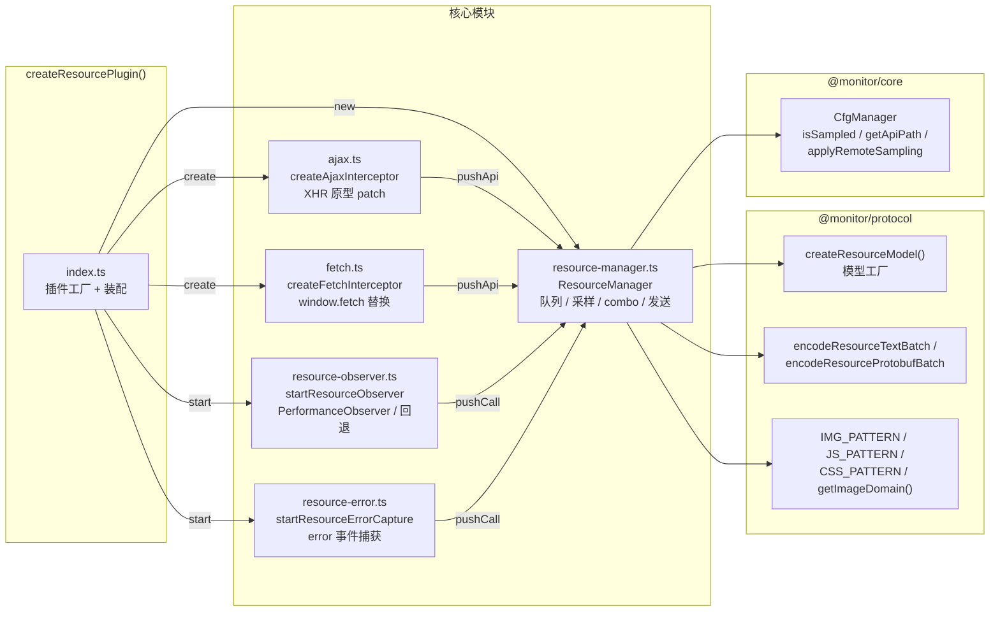
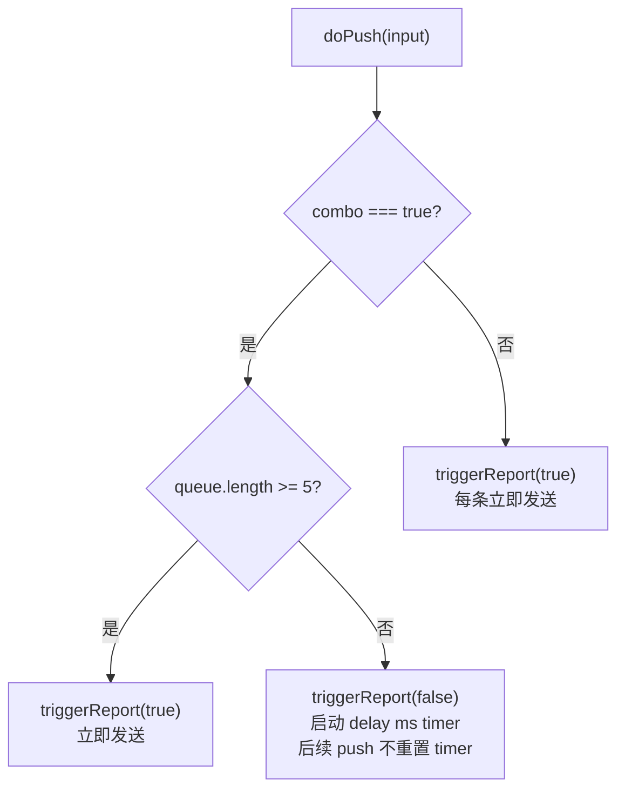
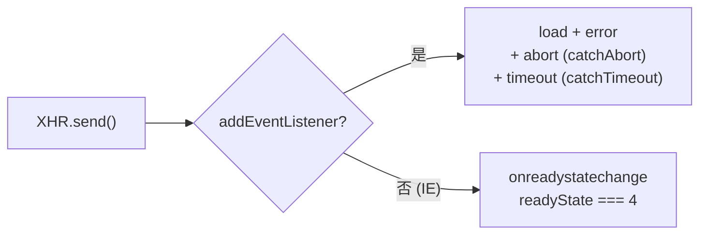
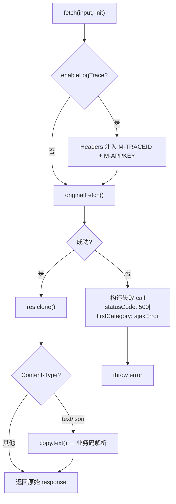
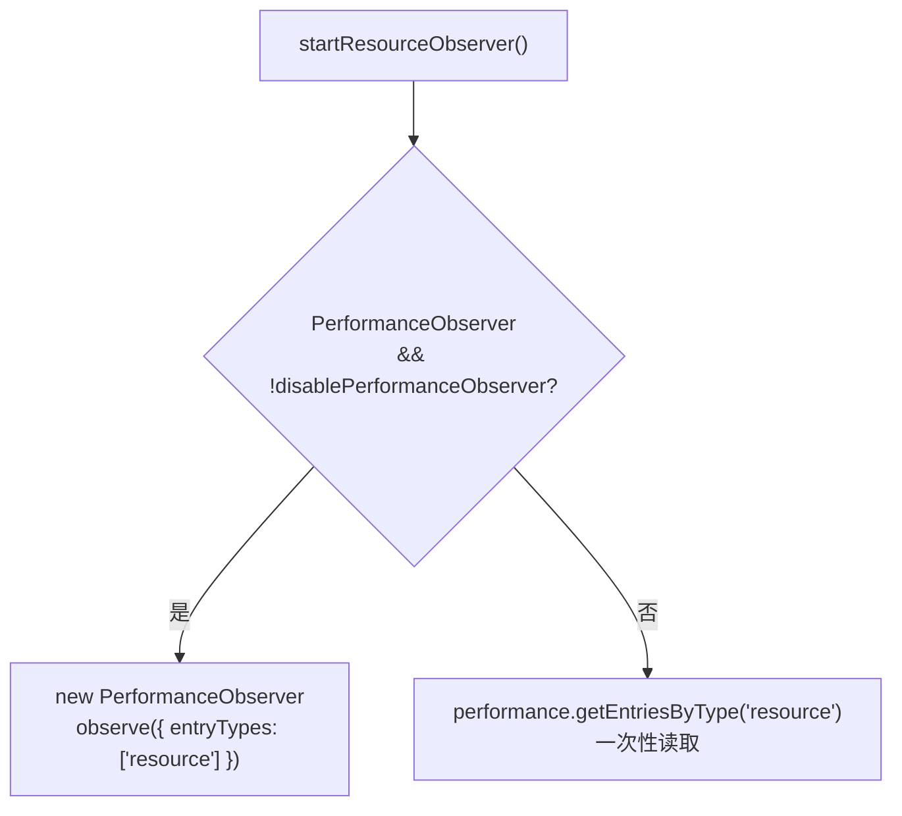
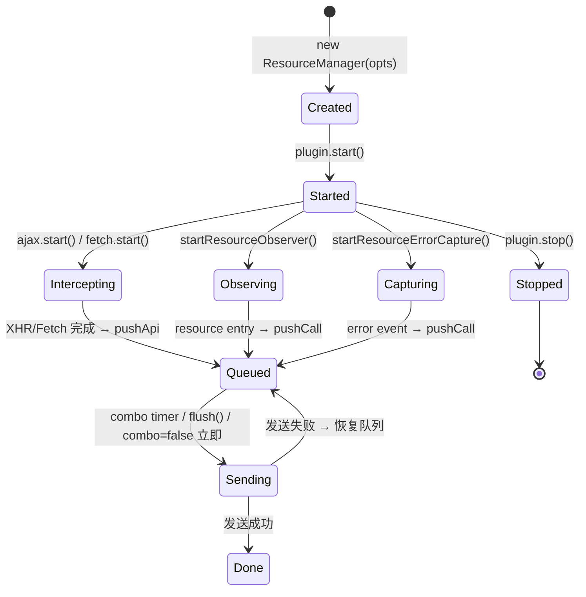

# plugin-resource（资源监控）实现原理

## 概述

plugin-resource 是 `@monitor/plugin-resource` 的资源与 API 监控插件。它负责三类采集：

1. **静态资源 Timing** — 通过 `PerformanceObserver` 监听页面资源加载耗时
2. **AJAX / Fetch 拦截** — 监控所有 XHR 和 fetch 请求的耗时、状态码、错误
3. **资源加载错误** — 通过全局 `error` 事件捕获 `<script>/<link>/` 加载失败

---

## 整体架构



---

## 模块详解

### 1. ResourceManager（resource-manager.ts）

资源上报的核心状态机，负责队列管理、采样、批量发送。

#### 1.1 双入口 + 独立采样

| 入口              | 采样键     | 用途                       |
| ----------------- | ---------- | -------------------------- |
| `pushCall(input)` | `resource` | 静态资源 Timing + 加载错误 |
| `pushApi(input)`  | `api`      | XHR / Fetch 请求           |
| `report(input)`   | —          | 快捷方法 = push + 立即发送 |

采样率通过 `ResourceConfig.sample` (默认 0.1) 和 `ResourceConfig.sampleApi` (默认 0.1) 独立控制。

#### 1.2 Combo 延迟



`triggerReport(reportNow)` 模式：

- `reportNow=true` → 直接 `sendBatch()`
- `reportNow=false` → `setTimeout(sendBatch, delay)`，timer 存在时不重置

#### 1.3 发送流程

```
sendBatch():
  stringify() → 合并 extension (region/operator/network/container/os/unionId)
  devMode?
    → true:  JSON        → POST /batchts        Content-Type: application/json
    → false: Protobuf    → POST /pbbatchts       Content-Type: application/x-protobuf
              (失败回退 JSON)
  URL 追加 &pageId=...&p=...
  await send(request)
  → 成功: handleRemoteConfig(response) → applyRemoteSampling(sampling)
  → 失败: 恢复队列 + throw
```

#### 1.4 onBatchPush Hook

入队前回调，可返回 `false` 阻止 push（）：

```typescript
onBatchPush?: (instance: ResourceModel) => boolean;
```

---

### 2. AJAX 拦截（ajax.ts）

通过 patch `window.XMLHttpRequest` 构造器拦截所有 XHR 请求。

#### 2.1 事件监听

的四事件模式：



#### 2.2 错误分级

`parseAjax` 的三级判断：

```
dispatchEvent(event):
  ① HTTP 状态码检测 (enableStatusCheck):
     true  → status >= 200 && < 300 或 304 → success
     false → state === 'load' → success

  ② 业务码解析 (autoBusinessCode):
     success=true 时 → getResponseHeader('Content-Type') → 检测 text/json
     → responseText → JSON.parse → parseResponse(response) → businessCode

  ③ statusCode 格式: "httpCode|businessCode"
     firstCategory: success → "" / error → "ajaxError"
     logContent:   success → "" / error → "from: xhr {state}. {httpCode} {statusText}"
```

#### 2.3 Trace ID 注入

`enableLogTrace=true` 时，对同源请求注入请求头：

```
M-TRACEID: {uuid}
M-APPKEY: fe_{project}
```

#### 2.4 防重入

通过 `isStarted()` 状态管理，重复 `start()` 不重复 patch；`stop()` 恢复原始 `XMLHttpRequest`。

---

### 3. Fetch 拦截（fetch.ts）

替换 `window.fetch`，包装请求/响应。

#### 3.1 请求跳过

```
method === 'HEAD' || mode === 'no-cors' → 不拦截，透传
```

#### 3.2 响应处理



#### 3.3 反爬检测

```
response.status === 403 && x-forbid-reason header 存在
  → ignoreMTSIForbidRequest=true 时静默跳过
```

#### 3.4 业务码解析

与 AJAX 一致：`autoBusinessCode=true` → JSON.parse → `parseResponse` → `statusCode: "httpCode|businessCode"`。

---

### 4. 资源 Timing 监控（resource-observer.ts）

#### 4.1 采集策略



#### 4.2 过滤管线

```
collectResourceEntries(entries):
  ① filterEntries: 仅保留 initiatorType ∈ {link, script, img, css}
  ② resourceReg:   URL 不匹配正则 → 跳过
  ③ filterResource: ignoreList.resource 正则匹配 → 跳过
```

#### 4.3 类型标准化

```
normalizeType(initiatorType, url):
  img | IMG_PATTERN.test(url)         → "image"
  script | (link && JS_PATTERN)       → "js"
  css   | (link && CSS_PATTERN)       → "css"
  xmlhttprequest                      → "ajax"
```

#### 4.4 图片监控

```
imageConfig.enable 时:
  transferSize > fileSize * 1000 → IMAGE_SIZE_EXCEED
  duration     > maxDuration    → IMAGE_DURATION_EXCEED
  → 通过 onImageExceed 回调上报至 ErrorManager
```

---

### 5. 资源加载错误（resource-error.ts）

通过 `window.addEventListener('error', listener, true)` 捕获阶段监听。

#### 5.1 过滤管线

```
listener(event):
  ① 元素类型: nodeName ∈ {script, link, img}
  ② URL 提取: element.src || element.href
  ③ 懒加载过滤: URL === location.href 前缀 → 跳过
  ④ resourceReg + ignoreList.resource 过滤
  ⑤ XPath 提取: getXPath(element)
  ⑥ content = url + '\n' + xpath
  → pushCall → ResourceManager
```

#### 5.2 XPath 提取

```
getXPath(element):
  id 存在 → //tagname[@id="xxx"]
  否则 → 向上遍历 parentElement，计算同级索引
  例: /html[1]/body[1]/div[3]/img[2]
```

---

## 数据模型

```typescript
type ResourceModel = Record<
  | "resourceUrl"
  | "connectType"
  | "type"
  | "timestamp"
  | "requestbyte"
  | "responsebyte"
  | "responsetime"
  | "project"
  | "pageUrl"
  | "realUrl"
  | "statusCode"
  | "firstCategory"
  | "secondCategory"
  | "logContent"
  | "traceid"
  | "ctags",
  string
>;

interface ResourceBatch {
  infos: ResourceModel[];
  region?: string;
  operator?: string;
  network?: string;
  container?: string;
  os?: string;
  unionId?: string;
}
```

- `statusCode` 格式: `"httpCode|businessCode"` (对齐)
- devMode JSON: `JSON.stringify(batch)`
- 生产 Protobuf: `encodeResourceProtobufBatch(batch)` (失败回退 JSON)

---

## 生命周期



---

## 关键配置

### ResourceConfig

| 配置项                       | 默认值                        | 说明                     |
| ---------------------------- | ----------------------------- | ------------------------ |
| `sample`                     | `0.1`                         | 静态资源采样率           |
| `sampleApi`                  | `0.1`                         | API 采样率               |
| `combo`                      | `true`                        | 是否延迟合并发送         |
| `delay`                      | `2000`                        | combo 延迟 (ms)          |
| `batchSize`                  | `20`                          | 预留                     |
| `resourceReg`                | `/(.51ping\|.dianping\|...)/` | 资源域名白名单正则       |
| `catchAbort`                 | `true`                        | XHR 是否捕获 abort       |
| `catchTimeout`               | `false`                       | XHR 是否捕获 timeout     |
| `enableStatusCheck`          | `false`                       | 是否 HTTP 状态码严格检测 |
| `ignoreMTSIForbidRequest`    | `true`                        | 是否忽略反爬拦截         |
| `disablePerformanceObserver` | `false`                       | 禁用 PerformanceObserver |
| `ignoreList`                 | `[]`                          | 资源 URL 忽略列表        |

### AjaxConfig

| 配置项             | 默认值                                        | 说明                  |
| ------------------ | --------------------------------------------- | --------------------- |
| `invalid`          | `true`                                        | 是否上报非法 URL      |
| `autoBusinessCode` | `false`                                       | 自动解析业务码        |
| `parseResponse`    | `res => ({ code: res.code \|\| res.status })` | 业务码提取函数        |
| `enableLogTrace`   | `false`                                       | 注入 M-TRACEID 请求头 |
| `timeout`          | `15000`                                       | XHR 超时阈值 (ms)     |

### ImageConfig

| 配置项        | 默认值  | 说明                  |
| ------------- | ------- | --------------------- |
| `fileSize`    | `100`   | 图片大小阈值 (KB)     |
| `maxDuration` | `30000` | 图片加载耗时阈值 (ms) |
| `filter`      | `null`  | 图片过滤函数          |

---

## 与 的差异

| 维度               |                                              | plugin-resource                        | 说明             |
| ------------------ | -------------------------------------------- | -------------------------------------- | ---------------- |
| 架构               | 单体 `ResManager`（~600 行）                 | 5 模块拆分 + 依赖注入                  | 独立测试、可替换 |
| 事件通信           | 内部 `Event` 总线 (ajaxCall/fetchCall)       | 直接回调注入                           | 更简洁           |
| XHR Patch          | 构造器替换，`isStarted()` 管理               |
| XHR 事件           | load/error/abort/timeout                     | 同上 + 可配置 catchAbort/catchTimeout  | 对齐             |
| 错误分级           | ✅ 状态码 + 业务码 + 超时 + 非法 URL         | ✅ 完整对齐                            | 核心差异已消除   |
| Fetch 响应体       | `res.clone()` + `copy.text()`                | ✅ 对齐                                |                  |
| x-forbid-reason    | ✅                                           | ✅                                     |                  |
| 采样               | resource / api 独立采样                      | ✅ 对齐，`sample: 0.1, sampleApi: 0.1` |                  |
| Combo 延迟         | delay 2000 + combo 开关                      | ✅ 对齐                                |                  |
| 图片监控           | IMAGE_SIZE_EXCEED / IMAGE_DURATION_EXCEED    | ✅ 对齐                                |                  |
| 类型标准化         | img→image, script→js, css                    | + IMG/JS/CSS_PATTERN URL 检测          | ✅ 对齐          |
| resourceReg 过滤   | 所有入口都过滤                               | 所有入口都过滤                         | ✅ 对齐          |
| ignoreList 过滤    | ignoreList.resource                          | ✅ 对齐                                |                  |
| Extension 合并     | region/operator/network/container/os/unionId | ✅ 对齐                                |                  |
| Protobuf 编码      | 生产环境 protobuf                            | ✅ 对齐，失败回退 JSON                 |                  |
| onBatchPush hook   | ✅                                           | ✅                                     |                  |
| handleRemoteConfig | ✅                                           | ✅                                     |                  |
| XPath              | ✅ localStorage                              | ✅                                     |                  |
| 条目去重           | entryCache                                   | ❌ (PerformanceObserver 天然去重)      | 不需要           |
| 动态回退轮询       | ajaxCall + 1500ms 轮询                       | ❌ (一次性读取)                        | 简化实现         |
| 日志               | ✅                                           | ❌ (明确排除)                          | 同 plugin-error  |

---

## 文件结构

```
packages/plugin-resource/
├── src/
│   ├── index.ts                  # createResourcePlugin() 插件工厂 + 装配
│   ├── ajax.ts                   # createAjaxInterceptor() XHR 拦截
│   ├── ajax.test.ts              # XHR 测试 (1)
│   ├── fetch.ts                  # createFetchInterceptor() Fetch 拦截
│   ├── fetch.test.ts             # Fetch 测试 (2)
│   ├── resource-manager.ts       # ResourceManager 核心类
│   ├── resource-manager.test.ts  # Manager 测试 (4)
│   ├── resource-observer.ts      # startResourceObserver() Timing 监控
│   ├── resource-observer.test.ts # Observer + Error 测试 (3)
│   ├── resource-error.ts         # startResourceErrorCapture() 错误捕获
│   ├── plugin.test.ts            # 集成测试 (1)
├── package.json
├── tsconfig.json
├── vite.config.ts
└── vitest.config.ts
```
